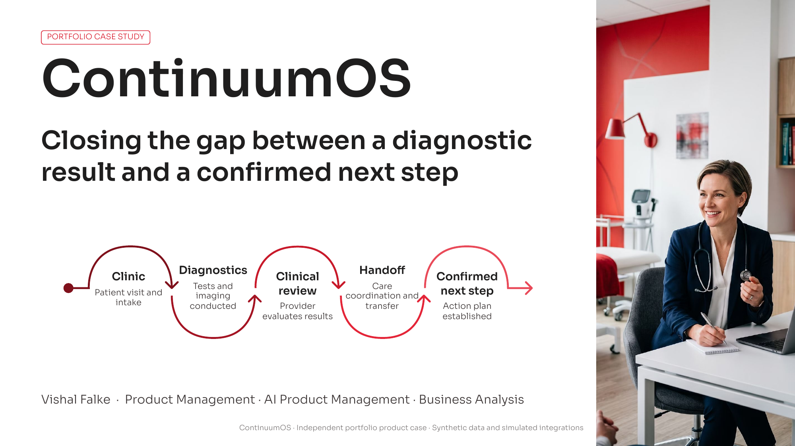
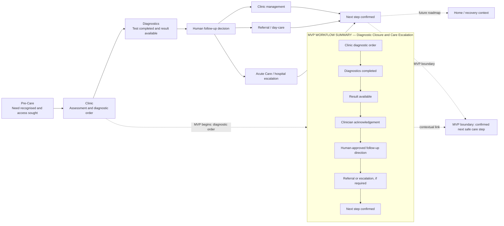
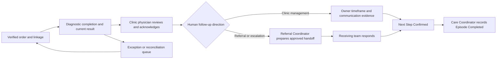
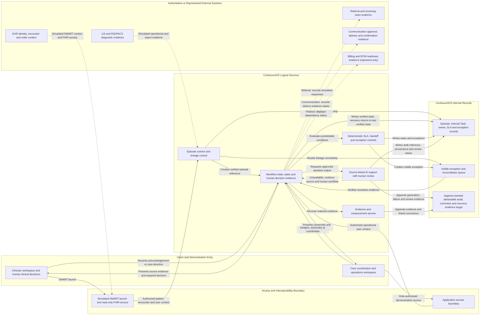
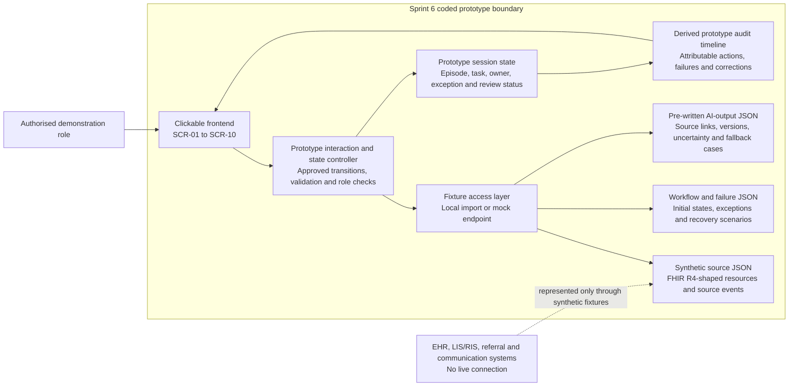
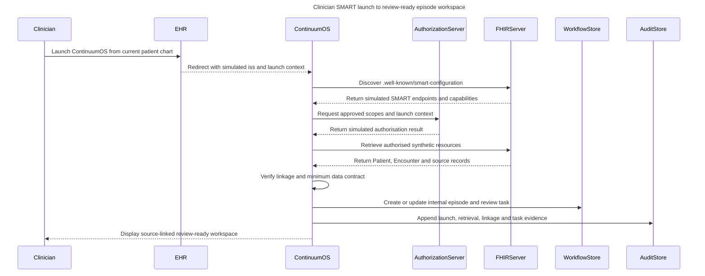
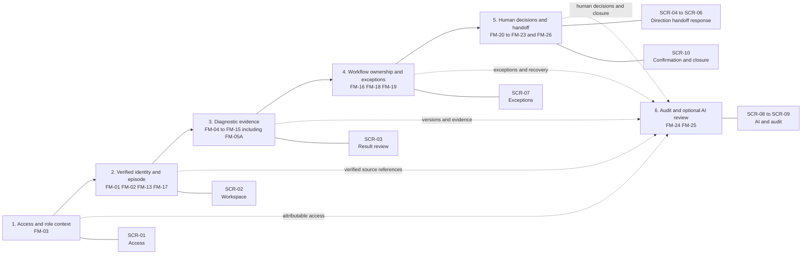
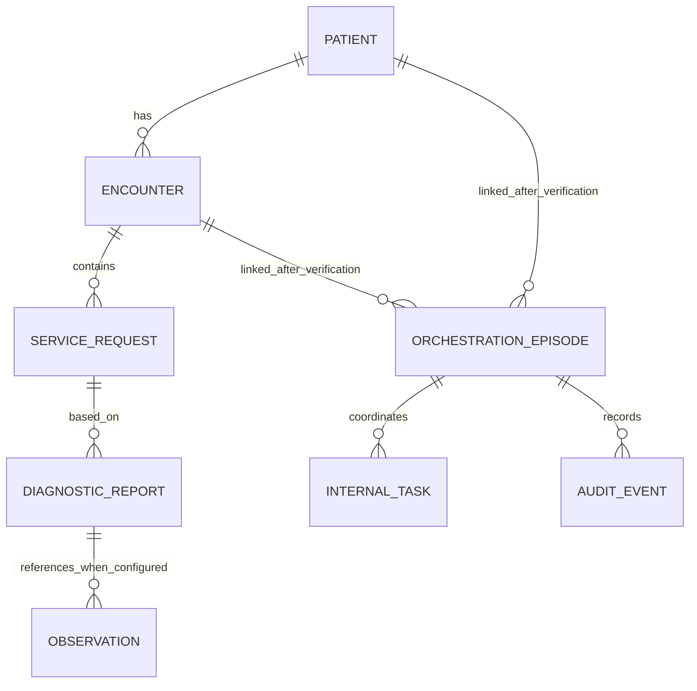
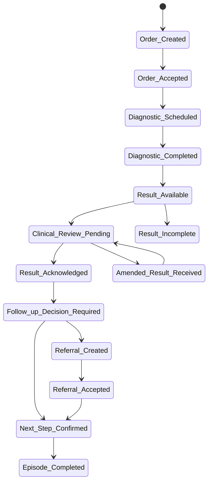

# ContinuumOS

> An independent portfolio case study for an AI-assisted diagnostic-closure workflow. It makes the path from a result being available to a human-confirmed next care step visible, attributable and recoverable.

[Start with the case at a glance](Sprints/Sprint_7_External_Validation_Synthetic_Pilot_and_Portfolio_Packaging/portfolio_case_at_a_glance.md) · [Explore the artifact index](Sprints/Sprint_7_External_Validation_Synthetic_Pilot_and_Portfolio_Packaging/portfolio_artifact_index.md) · [View the final case study (PDF)](Sprints/Sprint_7_External_Validation_Synthetic_Pilot_and_Portfolio_Packaging/ContinuumOS.pdf) · [Run the local prototype](#run-the-local-prototype)

[](Sprints/Sprint_7_External_Validation_Synthetic_Pilot_and_Portfolio_Packaging/ContinuumOS.pdf)

The PDF above is the primary portfolio artifact. Select the cover to open or download the full case study.

## What this repository demonstrates

ContinuumOS is a hypothetical care-orchestration overlay, not an EHR replacement. The bounded MVP follows one diagnostic-closure workflow:

```text
Result available
  -> clinician acknowledgement
  -> human follow-up direction
  -> referral handoff or clinic-management work
  -> receiving response where required
  -> next step confirmed or documented exception
```

The repository brings together product framing, operating-model decisions, requirements, architecture, a runnable React prototype, controlled test evidence and a final interview-ready case study.

## Start here: product, delivery and governance evidence

I developed this independent case from problem framing through workflow and requirements definition, prioritisation, architecture, a coded local prototype, controlled synthetic evaluation and future-readiness planning. The evidence below shows the work and its limits without implying a real hospital implementation, external user research or production deployment.

| Fast path | What an interviewer can establish quickly | Open |
|---|---|---|
| **1. Case at a glance** | The problem, users, my contribution, five defining decisions, MVP, proposed value, implementation, test evidence and open limitations. | [Read the case at a glance](Sprints/Sprint_7_External_Validation_Synthetic_Pilot_and_Portfolio_Packaging/portfolio_case_at_a_glance.md) |
| **2. Workflow and MVP** | How the broad care-continuity problem became one bounded diagnostic-closure workflow, with explicit in-scope and deferred capabilities. | [View the current-state workflow](01_Day_1_Product_Framing/current_state_workflow.md), [future-state workflow](01_Day_1_Product_Framing/future_state_workflow.md), [MVP scope](01_Day_1_Product_Framing/mvp_scope.md) and [prioritised backlog](Sprints/Sprint_5_Clickable_Prototype/prioritised_backlog_and_prototype_scenarios.md) |
| **3. Decisions and delivery** | Options considered, selected approaches, accepted trade-offs, ownership, prioritisation, risks and controlled change. | [Read the decision and trade-off story](Sprints/Sprint_7_External_Validation_Synthetic_Pilot_and_Portfolio_Packaging/decision_and_tradeoff_story.md) and [delivery evidence index](Sprints/Sprint_7_External_Validation_Synthetic_Pilot_and_Portfolio_Packaging/portfolio_artifact_index.md#mvp-prioritisation-and-delivery) |
| **4. UAT and traceability** | Why the critical tests mattered, which controls passed, how defects were retested and why the release decision remained bounded. | [Read the UAT business-reasoning view](Sprints/Sprint_7_External_Validation_Synthetic_Pilot_and_Portfolio_Packaging/uat_business_reasoning_readout.md) and [open the RTM](Sprints/Sprint_5_Clickable_Prototype/requirements_traceability_matrix.csv) |
| **5. Data and AI governance** | Source authority, synthetic FHIR-shaped data, validation, reconciliation, audit, KPI use, human review and AI fallback. | [Open the data-governance overview](Sprints/Sprint_7_External_Validation_Synthetic_Pilot_and_Portfolio_Packaging/data_governance_overview.md) and [AI governance evidence](Sprints/Sprint_4_Architecture_and_AI_Operating_Model/ai_service_cards_and_control_matrix.md) |
| **6. Prototype and visual models** | What is actually clickable, how the local runtime works, and how workflow, architecture, data and state relate. | [Run the prototype](#run-the-local-prototype), [scan the diagrams](#diagram-gallery) and [review future pilot readiness](Sprints/Sprint_7_External_Validation_Synthetic_Pilot_and_Portfolio_Packaging/future_pilot_readiness.md) |

For the complete curated evidence map, use the **[portfolio artifact index](Sprints/Sprint_7_External_Validation_Synthetic_Pilot_and_Portfolio_Packaging/portfolio_artifact_index.md)**. It separates what was designed, implemented locally, tested synthetically, represented/simulated and retained as future readiness.

## Diagram gallery

These repository-native diagrams make the workflow, data boundaries and implementation boundary reviewable from this landing page. They are design and portfolio evidence, not a claim of live hospital integration, production architecture or clinical validation. The coded local prototype is the React application described below; the EHR, FHIR, referral and AI-service interactions shown here are explicitly simulated.

### 1. Care journey and MVP boundary

The wider care journey provides context. The implemented portfolio workflow begins at the diagnostic order and ends at a human-confirmed next care step; home recovery remains future context.



Source: [high-level care journey](Sprints/Sprint_2_Care_Journey_and_Operating_Model/high_level_care_journey.md).

### 2. Business process and human decision gates



Source: [four-diagram traceability pack](Sprints/Sprint_5_Clickable_Prototype/four_diagram_traceability_pack.md).

### 3. Logical architecture and source-system boundary

This is a logical design: it separates source-system authority, ContinuumOS orchestration and human-controlled decisions. It is not a deployed topology.



Source: [simplified MVP architecture](Sprints/Sprint_4_Architecture_and_AI_Operating_Model/simplified_architecture.md).

### 4. Coded prototype runtime

This is the actual local implementation boundary: a clickable frontend, deterministic controllers and local synthetic fixtures. No external system or AI service is contacted.



Source: [simplified MVP architecture](Sprints/Sprint_4_Architecture_and_AI_Operating_Model/simplified_architecture.md).

### 5. Simulated SMART on FHIR launch and data access



Source: [SMART launch sequence](Sprints/Sprint_4_Architecture_and_AI_Operating_Model/smart_on_fhir_launch_sequence.md).

### 6. Cross-screen data flow



Source: [data dictionary visual guide](Sprints/Sprint_5_Clickable_Prototype/data_dictionary_visual_guide.md). This represents control dependencies, not automatic workflow progression.

### 7. Logical data relationships



`INTERNAL_TASK`, `ORCHESTRATION_EPISODE` and `AUDIT_EVENT` are logical internal records, not asserted FHIR resources or a physical production schema. Source: [four-diagram traceability pack](Sprints/Sprint_5_Clickable_Prototype/four_diagram_traceability_pack.md).

### 8. Workflow state lifecycle



Source: [four-diagram traceability pack](Sprints/Sprint_5_Clickable_Prototype/four_diagram_traceability_pack.md). The detailed exception and safe-return rules remain in the canonical transition artifacts.

## Guide: evidence by capability

Start with the case study and prototype, then follow the evidence area most relevant to the role. The links below are intentionally selective: they show how the product decision, requirements, delivery controls and safety boundaries connect.

| Capability | What it demonstrates | Open |
|---|---|---|
| Product and healthcare workflow judgement | A bounded diagnostic-closure problem, product trade-offs, human decision gates and a realistic care-coordination workflow. | [Final case study PDF](Sprints/Sprint_7_External_Validation_Synthetic_Pilot_and_Portfolio_Packaging/ContinuumOS.pdf), [case-study summary](portfolio_case_study_summary.md) and [exception workflow](Sprints/Sprint_2_Care_Journey_and_Operating_Model/mvp_exception_workflow.md) |
| Product discovery and MVP definition | Product framing, workflow states, assumptions, success measures and an intentionally constrained MVP rather than an EHR-replacement claim. | [Product case foundation](01_Day_1_Product_Framing/product_case_foundation.md), [MVP scope](01_Day_1_Product_Framing/mvp_scope.md) and [success metrics](01_Day_1_Product_Framing/success_metrics.md) |
| BRD, functional and non-functional requirements | A concise business requirements baseline, functional rules, non-functional controls, users, scope boundaries and acceptance-ready requirements. | [BRD-lite](Sprints/Sprint_5_Clickable_Prototype/brd_lite.md), [consolidated requirements register](Sprints/Sprint_5_Clickable_Prototype/consolidated_requirements_register.csv) and [business-rule and validation catalogue](Sprints/Sprint_5_Clickable_Prototype/business_rule_and_validation_catalogue.md) |
| End-to-end requirements traceability | Traceability from workflow and business rules to screens, acceptance criteria and controlled prototype evidence. | [Requirements traceability matrix](Sprints/Sprint_5_Clickable_Prototype/requirements_traceability_matrix.csv), [acceptance criteria catalogue](Sprints/Sprint_5_Clickable_Prototype/acceptance_criteria_catalogue.md) and [four-diagram traceability pack](Sprints/Sprint_5_Clickable_Prototype/four_diagram_traceability_pack.md) |
| Agile delivery and stakeholder control | Prioritisation, accountable decision rights, risk/dependency management, sprint planning, defect triage and release readiness. | [MoSCoW impact/effort matrix](Sprints/Sprint_5_Clickable_Prototype/moscow_impact_effort_prioritisation_matrix.csv), [RACI and decision-authority matrix](Sprints/Sprint_5_Clickable_Prototype/raci_and_decision_authority_matrix.csv), [RAID register](Sprints/Sprint_5_Clickable_Prototype/raid_register.csv), [Jira-style delivery backlog](Sprints/Sprint_6_Prototype_Build_Testing_and_Controlled_Release/jira_style_sprint_6_delivery_backlog.md) and [defect triage matrix](Sprints/Sprint_6_Prototype_Build_Testing_and_Controlled_Release/defect_log_and_triage_matrix.csv) |
| AI product management and safety | Narrow AI use cases; source-linked output; human review, edit/reject and manual fallback; prohibited autonomous actions; release gates and recovery controls. | [AI service cards and control matrix](Sprints/Sprint_4_Architecture_and_AI_Operating_Model/ai_service_cards_and_control_matrix.md), [product safety hazard/control register](Sprints/Sprint_6_Prototype_Build_Testing_and_Controlled_Release/product_safety_hazard_and_control_register.csv) and [go/no-go and rollback criteria](Sprints/Sprint_6_Prototype_Build_Testing_and_Controlled_Release/go_no_go_rollback_and_pilot_entry_criteria.md) |
| AI evaluation | A controlled rubric, review disposition and release thresholds for the two permitted AI assists. | [AI evaluation rubric and thresholds](Sprints/Sprint_6_Prototype_Build_Testing_and_Controlled_Release/ai_evaluation_rubric_and_release_thresholds.md) and [AI evaluation results](Sprints/Sprint_6_Prototype_Build_Testing_and_Controlled_Release/ai_evaluation_results.csv) |
| Workflow observability and auditability | The proposed event, audit and recovery model required to make workflow progress, human decisions, exceptions, corrections and AI review attributable. | [Audit and analytics data contract](Sprints/Sprint_4_Architecture_and_AI_Operating_Model/audit_and_analytics_data_contract.md), [event catalogue and recovery rules](Sprints/Sprint_4_Architecture_and_AI_Operating_Model/event_catalogue_and_recovery_rules.md) and [audit-trace requirement](Sprints/Sprint_5_Clickable_Prototype/consolidated_requirements_register.csv) |
| Product execution | A runnable, synthetic React prototype that makes workflow state, owner, evidence, exception recovery and AI review visible. | [Run the local prototype](#run-the-local-prototype), [screen specifications](Sprints/Sprint_5_Clickable_Prototype/screen_specifications_and_wireframe_pack.md) and [test execution evidence](Sprints/Sprint_6_Prototype_Build_Testing_and_Controlled_Release/test_execution_evidence.csv) |
| Evidence discipline | Clear separation of what was tested locally from what requires real-world clinical, operational, security, fairness and model-supplier validation. | [Final portfolio evidence pack](Sprints/Sprint_7_External_Validation_Synthetic_Pilot_and_Portfolio_Packaging/final_portfolio_evidence_pack.md), [synthetic-pilot method](Sprints/Sprint_7_External_Validation_Synthetic_Pilot_and_Portfolio_Packaging/synthetic_pilot_dataset_and_method.md) and [change-evidence table](Sprints/Sprint_7_External_Validation_Synthetic_Pilot_and_Portfolio_Packaging/change_evidence_table.csv) |

### Important evidence boundary

The AI evaluation is controlled synthetic-output evaluation, not deployed-model performance evidence. The audit and event artifacts specify workflow observability and auditability; this local prototype does not claim live telemetry, alerting, model-drift monitoring or a production incident-monitoring service. See the [final portfolio evidence pack](Sprints/Sprint_7_External_Validation_Synthetic_Pilot_and_Portfolio_Packaging/final_portfolio_evidence_pack.md) for the retained limits and required next-stage validation.

## Run the local prototype

The prototype is a local, synthetic demonstration. It has no production backend, live hospital connection, real patient data or model call.

```powershell
git clone https://github.com/VishalFalke/ContinuumOS.git
cd ContinuumOS\prototype
npm install
npm run dev
```

Open the local URL printed by Vite (normally `http://localhost:5173`). The prototype uses pre-approved synthetic fixtures and represented workflow states; it is designed for exploration, not for clinical use.

If a Windows-managed folder prevents Vite from using its default configuration loader, start the same local app with:

```powershell
node node_modules/vite/bin/vite.js --configLoader runner --host 127.0.0.1
```

## Product and safety boundary

- Clinical acknowledgement, follow-up direction, referral routing, receiving-team response, next-step confirmation and scoped closure remain human-controlled.
- AI is limited to source-linked, reviewable drafts. It cannot diagnose, choose a pathway, approve or send a referral, accept a referral, confirm a next step or close an episode.
- Uncertain identity, encounter or event linkage is routed to an exception path rather than silently attached.
- The prototype uses only synthetic data. It is not clinical advice, production software, clinical validation, regulatory evidence or evidence of a live deployment.

## Evidence at a glance

| Area | Recorded evidence | Important limit |
|---|---|---|
| Prototype quality | TypeScript lint and 85 Node tests passed; browser walkthroughs and an isolated production bundle passed | The standard build remains limited by managed-workspace output permissions |
| Synthetic pilot | 20 controlled runs of one approved tracer passed | This is not 20 unique episodes, a human task-time study or operational performance evidence |
| Product refinement | Six documented internal Product Owner findings led to bounded changes and retests | This is internal review, not external reviewer research |
| AI controls | Source references, authorised human disposition, correction rationale and manual fallback are demonstrated | This is not deployed-model quality, fairness or supplier-assurance evidence |

For sources, decisions, retests and open evidence needs, see the [final portfolio evidence pack](Sprints/Sprint_7_External_Validation_Synthetic_Pilot_and_Portfolio_Packaging/final_portfolio_evidence_pack.md) and [Sprint 7 change-evidence table](Sprints/Sprint_7_External_Validation_Synthetic_Pilot_and_Portfolio_Packaging/change_evidence_table.csv).

## Repository guide

| Area | Contents |
|---|---|
| `00_Project_Charter/` | Case boundary, objectives, constraints and evidence status |
| `01_Day_1_Product_Framing/` | Product case, workflow model, tracer patient and decision baseline |
| `Sprints/Sprint_2_Care_Journey_and_Operating_Model/` | Care journey, decision rights, sources of record and failure paths |
| `Sprints/Sprint_3_Users_Decisions_and_MVP/` | Users, jobs, MVP scope, field mapping and integration assumptions |
| `Sprints/Sprint_4_Architecture_and_AI_Operating_Model/` | Logical architecture, simulated interoperability boundary, AI controls and audit model |
| `Sprints/Sprint_5_Clickable_Prototype/` | Requirements baseline, traceability and screen specifications |
| `Sprints/Sprint_6_Prototype_Build_Testing_and_Controlled_Release/` | Prototype, testing, safety and controlled-release evidence |
| `Sprints/Sprint_7_External_Validation_Synthetic_Pilot_and_Portfolio_Packaging/` | Synthetic-pilot evidence, change record, final PDF and final presentation |
| `prototype/` | Runnable React and Vite prototype with synthetic fixtures and tests |

## License and use

This repository is provided for portfolio review and local exploration. Please preserve the synthetic-data and non-production boundaries when sharing or adapting the work.
