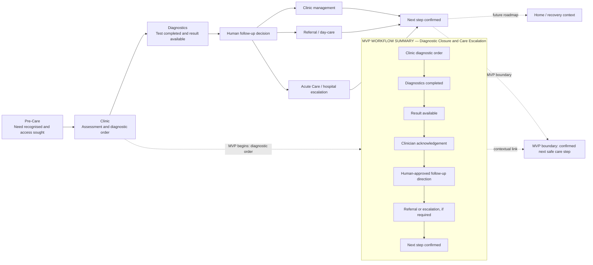

# Sprint 2 — High-Level Care Journey Map

## Purpose and scope

This map shows the broad ContinuumOS vision across five care settings while highlighting the narrow diagnostic-closure MVP. The five-stage journey is operating-model context. It does not claim that Sprint 2 builds home monitoring, discharge coordination, device integration, live payer connectivity or a hospital command centre.

The detailed workflow uses the synthetic tracer case: Asha Mehta, `SYN-PAT-1001`. No definitive disease is defined or inferred.

## Broad journey: Pre-Care → Clinic → Diagnostics → Acute Care → Home

The journey is not a mandatory path for every patient. Acute Care is conditional on a human-approved escalation decision, and Home represents a future continuity context after the MVP’s confirmed next step.



## Stage operating map

| Stage | Patient need | Participating roles | Major systems | Important handoffs | Likely workflow state | ContinuumOS contribution | Outside the MVP |
|---|---|---|---|---|---|---|---|
| **Pre-Care** | Recognise a health concern, seek access and provide enough context to begin care. | Patient; caregiver where relevant; access or scheduling staff; primary-care team. | Patient access or scheduling tool; telephone or front-desk process; clinic EHR or registration system. | Patient or caregiver → clinic; registration and encounter context → clinic team. | No ContinuumOS episode yet. This is pre-episode context. | Future context only: establishes why a coordinated episode may later be needed. ContinuumOS does not make a clinical assessment or create an episode before the diagnostic trigger. | Patient triage, diagnosis, registration redesign, appointment access and population-health outreach. |
| **Clinic** | Receive assessment, understand the immediate plan and have a diagnostic order created with the correct patient and encounter context. | Patient; clinic physician; nurse or clinical support; Care Coordinator; diagnostic operations contact; registration staff. | Clinic EHR; scheduling; simulated SMART on FHIR launch; synthetic Patient, Encounter and ServiceRequest records. | Clinic → diagnostics: accepted diagnostic order and scheduling context. Clinic → Care Coordinator: episode ownership and follow-up visibility. | **Order Created** → **Order Accepted** → **Diagnostic Scheduled**. Patient or encounter uncertainty routes to **Patient Match Failed** or **Encounter Missing**. | Creates or links the shared care episode after linkage rules or human reconciliation; displays owner, SLA, blockers and source-linked order status; routes predictable workflow work. | Replacement of the EHR, autonomous patient matching, clinical diagnosis, clinical prioritisation and redesign of all clinic operations. |
| **Diagnostics** | Complete the ordered test and make the current source-linked report status available to the responsible clinic team. | Diagnostic operations user; diagnostic professional; clinic physician; Care Coordinator. | Diagnostic scheduling system; simulated RIS/PACS or laboratory source; synthetic Observation and DiagnosticReport records; ContinuumOS acknowledgement queue. | Diagnostics → clinic: result event, report version and source context. Diagnostic operations → Care Coordinator or physician: acknowledgement work with named owner and SLA. | **Diagnostic Completed** → **Result Available** → **Clinical Review Pending**. Incomplete, amended, duplicate or unavailable events route to explicit exceptions. | Makes result status distinct from clinical review; preserves report versions; creates acknowledgement work; shows owner, ageing, blockers and audit trail; may produce a source-linked summary for human review. | Diagnostic interpretation by AI, autonomous clinical significance, replacement of RIS/PACS/LIS, live device integration and production interoperability. |
| **Acute Care** | If clinically appropriate, reach the next receiving team with an approved direction, accepted handoff and required readiness information. | Clinic physician; Care Coordinator; Referral Coordinator; Receiving team; Billing/pre-authorisation user; facility or appointment staff. | Referral workflow; receiving-site EHR or scheduling system; simulated administrative or payer workflow; synthetic Task data. | Clinic → Referral Coordinator: human-approved referral or escalation. Referral Coordinator → Receiving team: handoff package. Receiving team → clinic: acceptance or rejection. Billing/pre-authorisation → operational team: readiness or denial status. | **Follow-up Decision Required** → **Referral Created** → **Referral Accepted** → **Financial Readiness Pending** where required → **Next Step Confirmed**. | Routes work only after human approval; tracks receiving-team response, owner, SLA, prerequisites, financial-readiness status, patient communication and audit history; supports a human-reviewed referral handoff draft. | Autonomous referral approval, emergency triage, admission decisions, hospital command centre, surgery or procedure booking, real payer authorisation and clinical treatment decisions. |
| **Home** | Understand and follow the confirmed next step, receive approved communication and continue care or recovery with the appropriate care team. | Patient; caregiver; clinic or receiving-team follow-up owner; community or home-recovery team where relevant. | Patient communication channel; receiving-team or clinic record; possible future home-monitoring or device systems. | Care team → patient or caregiver: approved next-step communication. Receiving team or clinic → home-recovery team where a future pathway exists. | **Next Step Confirmed** → **Episode Completed** for this MVP’s workflow closure. Broader home-recovery states are future roadmap context. | Records communication status and closure evidence for the confirmed next step; preserves the audit trail. It does not coordinate the full home-recovery journey in Sprint 2. | Discharge coordination, home monitoring, device integration, medication adherence, remote clinical surveillance and longitudinal home-recovery orchestration. |

## MVP workflow summary

The following is a summary of the MVP lane. The full workflow is documented in `mvp_diagnostic_workflow.md`.

```text
Clinic diagnostic order
        ↓
Diagnostics completed
        ↓
Result available
        ↓
Clinician acknowledgement
        ↓
Human-approved follow-up direction
        ↓
Referral or escalation, if required
        ↓
Next step confirmed
```

### MVP lane controls

| MVP step | Human-control requirement | ContinuumOS role |
|---|---|---|
| Clinic diagnostic order | Patient and encounter linkage must be confirmed or reconciled by an authorised human when uncertain. | Create or link the episode, preserve source references and show linkage status. |
| Diagnostics completed | Diagnostic operations handles completion, cancellation, no-show or incomplete source events. | Record diagnostic status and keep the result event separate from clinical review. |
| Result available | The current report status and linkage must be recorded. Formal acknowledgement requirements for final, preliminary or urgent reports remain subject to the open operating assumption below. | Preserve report version, create acknowledgement work, assign owner and start SLA ageing. |
| Clinician acknowledgement | The clinician reviews the source report and explicitly acknowledges the current version. | Display source-linked context and audit the acknowledgement; AI cannot acknowledge on the clinician’s behalf. |
| Human-approved follow-up direction | The clinician chooses clinic management, referral or hospital escalation. | Present the workflow options and create downstream work only after approval. |
| Referral or escalation, if required | Receiving-team acceptance, facility or appointment confirmation and financial authorisation remain human-controlled where applicable. | Track handoff status, owner, prerequisites, blockers, financial readiness and approved communication. |
| Next step confirmed | A human confirms the named owner, destination or responsible team, timeframe, required task and patient communication. | Record confirmation and preserve the audit timeline; do not imply surgery, discharge or home recovery. |

## Boundary between broad vision and Sprint 2 work

| Concept | Treatment in this artifact |
|---|---|
| Clinic-to-home journey | Broad product context and future operating-model direction. |
| Diagnostic-to-next-step workflow | MVP workflow summary in this artifact; the detailed Sprint 2 workflow is maintained in the companion artifact. |
| Acute Care | Conditional destination after a human-approved hospital escalation; not a command-centre build. |
| Home | Future continuity context after next-step confirmation; not home-monitoring or discharge implementation. |
| ContinuumOS | Orchestration overlay for shared workflow state, ownership, blockers, exceptions, communication status and audit history. |
| Clinical, identity, referral and financial authority | Remains with humans and source-system processes. |

## Canonical state vocabulary

Sprint 2 uses the exact Sprint 1 state names. These are the canonical terms for journey maps, operating-model tables, later requirements and the prototype:

**Core states:** `Order Created`, `Order Accepted`, `Diagnostic Scheduled`, `Diagnostic Completed`, `Result Available`, `Clinical Review Pending`, `Result Acknowledged`, `Follow-up Decision Required`, `Referral Created`, `Referral Accepted`, `Financial Readiness Pending`, `Next Step Confirmed`, `Episode Completed`.

**Exception states:** `Patient Match Failed`, `Encounter Missing`, `Duplicate Event Suspected`, `Result Incomplete`, `Amended Result Received`, `Clinician Unavailable`, `Referral Rejected`, `Payer Information Missing`, `Authorisation Denied`, `Integration Unavailable`.

Do not introduce near-duplicate terms such as “Result Review Pending” or “Clinician Review Pending.” Any proposed state change must be recorded against the Sprint 1 state model and transition table before it is used elsewhere.

## Open operating assumption: final versus preliminary results

**Proposed rule:** final results require formal acknowledgement. Preliminary or urgent results may require an earlier review workflow without closing the final-result obligation.

This is an open operating assumption, not a fixed clinical rule. The detailed MVP workflow documents how a preliminary or urgent result is intended to be surfaced, who owns the earlier review, what is recorded, and how the final report still requires formal acknowledgement. It must be validated with appropriate clinical and operational input before implementation or safety claims.

## Traceability to Sprint 1

| Journey decision | Sprint 1 reference | Evidence status | Scope impact |
|---|---|---|---|
| Use five stages from Pre-Care through Home | `product_case_foundation.md` | Product vision / proposed operating-model framing | Represent only; no broader journey implementation in Sprint 2 |
| Start the MVP workflow summary at the diagnostic order | `mvp_scope.md`, `tracer_patient.md` | Recorded product decision | MVP scope preserved |
| Require explicit acknowledgement after result availability | `future_state_workflow.md`, `care_episode_state_model.md` | Recorded workflow control | MVP scope preserved |
| Use human-approved clinic, referral or escalation outcomes | `decision_register.csv`, `mvp_scope.md` | Recorded product decision | Human gate preserved |
| Show financial readiness only after relevant prerequisites | `mvp_scope.md`, `future_state_workflow.md` | Proposed capability / workflow assumption | Represent only; no autonomous authorisation |
| End at the confirmed next safe care step | `mvp_scope.md`, `state_transition_table.csv` | Recorded product boundary | Surgery, discharge and home recovery remain deferred |
| Route uncertain linkage to exceptions | `care_episode_state_model.md`, `state_transition_table.csv` | Safety control / validation requirement | No silent episode attachment |

## Evidence boundary

This is a proposed journey and operating-model map for a synthetic portfolio case. It does not establish that every organisation follows these stages, that the handoffs are universally configured this way, or that ContinuumOS has achieved any workflow or clinical outcome.

## Step 1 completion criteria

- [x] Five broad stages are mapped: Pre-Care, Clinic, Diagnostics, Acute Care and Home.
- [x] Each stage includes patient need, roles, systems, handoffs, likely state, ContinuumOS contribution and outside-MVP scope.
- [x] The MVP workflow summary is visually highlighted and labelled as a summary, not the detailed workflow.
- [x] The broad journey is explicitly separated from the detailed MVP workflow.
- [x] Home monitoring, discharge coordination, device integration and a hospital command centre are explicitly outside Sprint 2 build scope.
- [x] Every major journey decision is traced to Sprint 1.
- [x] Canonical Sprint 1 state names are recorded for reuse across later artifacts and prototype work.
- [x] The preliminary/final result handling rule is recorded as an open operating assumption.
