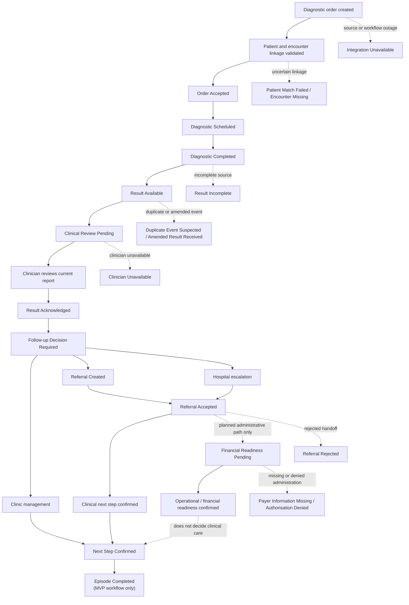

# Sprint 2 — Detailed MVP Diagnostic Workflow

## Purpose and evidence boundary

This is the detailed operating-model walkthrough for one synthetic episode: Asha Mehta, age 48, `SYN-PAT-1001`. The primary diagnostic event is an abdominal ultrasound; laboratory tests are supporting context only.

The workflow starts when the clinic diagnostic order is created and ends when a human-confirmed next safe care step is recorded and the diagnostic-closure workflow is completed. Here, `Episode Completed` means the MVP workflow has ended after accountable transfer of the next care step. It does not mean that Asha’s broader clinical episode, referral, admission or recovery is complete. This is a proposed portfolio workflow based on the approved Sprint 1 case. It does not claim that every organisation uses these systems, roles, SLAs or handoffs, and it does not claim implementation, user research, clinical validation or achieved outcomes.

## Non-negotiable control

> **Result Available ≠ Clinically Reviewed.**

Result Available does not mean clinical review has started, completed or been acknowledged.

When the diagnostic report becomes available, ContinuumOS may create an acknowledgement task, assign an owner, start SLA ageing and prepare a source-linked summary. It cannot treat the result as clinically reviewed, acknowledged or acted upon until the responsible clinician reviews the current source report and explicitly acknowledges it.

Urgent handling is triggered only by an authorised human decision or a validated source-system flag. ContinuumOS does not infer clinical urgency, and the MVP does not use AI to determine urgency or clinical priority.

## MVP workflow completion boundary

`Episode Completed` is the canonical Sprint 1 state name, but its meaning is limited in this MVP:

> **Episode Completed means the diagnostic-closure workflow has ended after accountable transfer of the next care step. It does not mean that the patient’s broader clinical episode, referral, admission or recovery is complete.**

For an urgent hospital escalation, the diagnostic-closure workflow may be completed after the clinical direction, receiving-team handoff, accountable owner and patient communication are confirmed while administrative financial-readiness work remains separately visible and unresolved. The broader care journey continues outside this MVP.

## Canonical state vocabulary

This artifact uses the exact Sprint 1 state names. No near-duplicate terms are introduced.

**Core states:** `Order Created`, `Order Accepted`, `Diagnostic Scheduled`, `Diagnostic Completed`, `Result Available`, `Clinical Review Pending`, `Result Acknowledged`, `Follow-up Decision Required`, `Referral Created`, `Referral Accepted`, `Financial Readiness Pending`, `Next Step Confirmed`, `Episode Completed`.

**Exception states:** `Patient Match Failed`, `Encounter Missing`, `Duplicate Event Suspected`, `Result Incomplete`, `Amended Result Received`, `Clinician Unavailable`, `Referral Rejected`, `Payer Information Missing`, `Authorisation Denied`, `Integration Unavailable`.

## Workflow overview

## Detailed step-by-step journey

The table below is the end-to-end walkthrough. Its `Accountable role` field is intentionally compact for narrative readability; the companion `mvp_operating_control_table.md` separates **Clinical decision owner**, **Operational workflow owner** and **System actor** for implementation and ownership work.

| # | Journey step | Current state / current-state gap | Future state | Accountable role | System action | AI-assisted action | Human decision or gate | Blocker / exception branch | SLA / ageing | Audit evidence |
|---:|---|---|---|---|---|---|---|---|---|---|
| 1 | Order creation | The clinic creates the ultrasound order in its local workflow. Supporting laboratory orders may be recorded separately. The diagnostic-to-follow-up responsibility is not necessarily visible across teams. | `Order Created` | Clinic physician for clinical order; diagnostic operations for acceptance work | Create or update the care episode reference, retain the source order and display the initial linkage status. | May summarise available episode context; no clinical interpretation. | Physician confirms the diagnostic order and intended patient encounter in the source workflow. | Incomplete order context → `Encounter Missing` or operational clarification. Unavailable source → `Integration Unavailable`. | Start ageing against local order-acceptance policy; no universal SLA is claimed. | Source order ID, source system, patient/encounter references, order timestamp, ordering role, episode ID and linkage status. |
| 2 | Patient and encounter linkage | Registration, encounter and diagnostic records may be separated or repeatedly reconciled. An uncertain match can be handled informally in a fragmented workflow. | Confirmed linkage permits `Order Created` to progress; uncertainty remains in `Patient Match Failed` or `Encounter Missing`. | Care Coordinator for operational accountability; Identity reconciliation reviewer performs reconciliation | Apply defined matching rules, show match status and reconciliation reason, and route uncertainty to the exception queue. | May flag conflicting or missing context with source references; cannot attach the event or resolve identity autonomously. | Authorised human confirms or rejects the patient, encounter or event match. | Patient cannot be matched → `Patient Match Failed`. Required encounter cannot be confirmed → `Encounter Missing`. | Age from exception creation until human reconciliation; do not start normal clinical SLA on an unlinked event. | Matching inputs, deterministic rule result, reconciliation reason, reviewer identity and role, decision, timestamp, source references, correction history and safe-return state. |
| 3 | Diagnostic acceptance | The diagnostic provider may receive the order through a separate queue or communication channel; acceptance may not be visible to the clinic coordinator. | `Order Accepted` | Diagnostic operations user | Record the provider acceptance event and make scheduling work visible. ContinuumOS records acceptance; it does not accept the order itself. | None required. | Diagnostic operations accepts the order or requests clarification in its source workflow. | Missing order details, rejected order or unavailable interface → operational exception or `Integration Unavailable`. | Age from order creation or receipt until acceptance under the proposed local policy. | Acceptance event ID, source, timestamp, receiving service, order version, clarification/rejection reason and actor. |
| 4 | Diagnostic scheduling | Scheduling may be handled in a diagnostic system without a shared owner or visible ageing for the clinic. | `Diagnostic Scheduled` | Diagnostic operations user | Record appointment or slot details, owner, date/time and status; show cancellation or rescheduling. | None required. | Diagnostic operations manages scheduling, rescheduling, cancellation or no-show handling. | Capacity issue, cancellation, no-show or missing order context; return to the appropriate operational state or exception. | Age from accepted order to scheduled appointment under local policy. | Appointment or slot ID, scheduled date/time, status changes, actor, source event, reason for change and linked episode. |
| 5 | Diagnostic completion | Completion and result publication are separate events. A completed test may not create an accountable follow-up task. | `Diagnostic Completed` | Diagnostic operations user | Record the completion event and wait for a result event; do not infer that a result is available. | May identify missing handoff context without judging clinical significance. | Diagnostic operations confirms the examination or addresses incomplete examination evidence. | Incomplete examination or source context → `Result Incomplete`. Outage → `Integration Unavailable`. | Age from completion until a current report status is received. | Completion event, examination ID, source, timestamp, status, missing-field record, correction and linked episode. |
| 6 | Result availability | The report may sit in a diagnostic system or inbox while the clinic and coordinator cannot tell whether it has been reviewed. | `Result Available` | Diagnostic operations user until acknowledgement work is assigned; clinic physician owns clinical review after assignment | Preserve the report version, record availability and create acknowledgement work with owner and SLA. | Produce a source-linked episode summary covering relevant facts, current state, report version, open tasks and missing or conflicting context. It must not determine clinical significance. | No acknowledgement occurs at this step. The responsible clinician must later review the current source report. | Incomplete report → `Result Incomplete`. Duplicate event → `Duplicate Event Suspected`. New version → `Amended Result Received`. Uncertain linkage → reconciliation. | Result-ready-to-acknowledgement ageing starts at the recorded result-availability event, subject to the preliminary/final assumption below. | DiagnosticReport ID and version, Observation references, availability timestamp, source, episode link, owner, SLA, AI source references and output audit. |
| 7 | Acknowledgement queue | “Available” may be mistaken for “reviewed”; no shared queue may show owner, ageing or escalation. | `Clinical Review Pending` | Clinic physician | Place the episode in the acknowledgement queue, display report version, owner, SLA age and deterministic overdue conditions. | May provide a source-linked summary or flag missing operational context; cannot prioritise clinical urgency or acknowledge. | Clinic physician remains responsible for opening and reviewing the source report. | Assigned clinician unavailable → `Clinician Unavailable`. Report amended or incomplete → corresponding exception. | Age until explicit acknowledgement; overdue status is a deterministic workflow condition, not an AI judgement. | Queue-entry event, assignment, owner/role, report version, created/due timestamps, ageing history, reminders/escalations and access record. |
| 8 | Clinician review | The clinician may review the source report, but review status may not be visible to the coordinator or referral team. | Remains `Clinical Review Pending` until the current report is reviewed and acknowledged. | Clinic physician | Display source report, source-linked context, report version, open tasks and exception flags; record review activity separately from acknowledgement. | Source-linked summary only; it may surface missing or conflicting information but cannot decide clinical significance or urgency. | Clinician reviews the current source report and determines whether the information is sufficient for acknowledgement and follow-up decision. | Missing information, amended report or clinician unavailable; route to explicit exception or remain pending. | Age until review and acknowledgement; missed SLA creates operational escalation, not autonomous clinical escalation. | Source-report access event, report version, reviewer, role, timestamp, review note or disposition, corrections and exception references. |
| 9 | Explicit acknowledgement | A result can be verbally or informally reviewed without a durable acknowledgement event tied to the report version. | `Result Acknowledged` | Clinic physician | Record explicit acknowledgement against the current report version and open the follow-up decision task. | None required for acknowledgement; AI summary cannot substitute for the clinician’s action. | Clinician explicitly acknowledges the current source report. | Amended report arrives after an earlier acknowledgement → `Amended Result Received`, then renewed `Clinical Review Pending`. | Follow-up-decision ageing starts after acknowledgement. | Acknowledgement event, clinician identity and role, timestamp, report version, acknowledgement status, source reference and any correction/override. |
| 10 | Follow-up decision | The clinician may decide next steps, but the decision, owner, referral destination and patient communication may be tracked separately. | `Follow-up Decision Required` | Clinic physician for clinical direction; Care Coordinator for operational closure evidence | Create the decision task, show allowed pathway options and record the selected direction only after human action. | May prepare a source-linked context summary and identify missing operational information; cannot recommend or select the care direction. | Clinician selects clinic management, day-care referral or hospital escalation. | Clinician unavailable → `Clinician Unavailable`. Missing context may keep the decision pending. | Age from acknowledgement until a human-approved direction is recorded. | Decision task, selected pathway, decision-maker, role, timestamp, rationale or approved reason, source references and audit event. |
| 11 | Clinic-management path | Follow-up may be arranged through a local clinic process without a shared closure rule. | `Next Step Confirmed` after closure conditions are verified; then `Episode Completed`. | Clinic physician for direction; Care Coordinator for closure verification | Record named clinic owner, follow-up task, timeframe, patient communication status and closure evidence. | May draft approved patient communication; requires human review before use. | Clinician chooses clinic management. Care Coordinator verifies owner, timeframe, task and communication before confirmation. | Missing owner, timeframe, task or communication keeps the episode in `Follow-up Decision Required` or routes to operational follow-up. | Age until all closure conditions are present; no universal timeframe is claimed. | Human decision, owner assignment, task ID, due date, approved communication, confirmation timestamp and closure verification. |
| 12 | Day-care referral path | Referral preparation may require repeated transfer of the report, reason, documents and patient information between teams. | `Referral Created` | Clinic physician approves direction; Referral Coordinator owns preparation and routing | Create and route the referral task only after approval; track destination, prerequisites, owner and SLA. | Prepare a source-linked referral handoff draft after approval, including approved reason, acknowledgement status, prerequisites, missing items and draft patient communication. | Clinic physician approves the referral direction; Referral Coordinator approves the operational handoff package before use. | Missing documents, receiving-team rejection or unavailable workflow service → `Referral Rejected`, `Integration Unavailable` or another explicit exception. | Age from referral approval/task creation until receiving-team response. | Referral approval, task ID, destination, handoff version, source references, reviewer approval, corrections/rejections, timestamps and status history. |
| 13 | Hospital-escalation path | Clinical escalation, referral preparation and administrative readiness may be tracked in separate workflows, creating delays or unclear responsibility. | `Referral Created` | Clinic physician for approval; Referral Coordinator for handoff; Care Coordinator for cross-setting visibility | Route the approved escalation, track receiving team, owner, prerequisites, blockers and selected financial-readiness dependency. | Prepare the source-linked handoff draft only after approval; no clinical prioritisation or referral approval. | Clinic physician approves hospital escalation. Referral Coordinator approves the operational handoff package; Clinic physician approves patient-facing clinical content where clinically contextual. | Receiving-team rejection → `Referral Rejected`. Missing administration → `Payer Information Missing`. Outage → `Integration Unavailable`. | Age from approved escalation until receiving-team response and pathway readiness. Urgent clinical care must not be delayed by this administrative workflow. | Escalation approval, destination, handoff package, acceptance requirement, prerequisite checklist, reviewer approvals, patient communication and audit trail. |
| 14 | Receiving-team acceptance | The receiving service may not confirm acceptance through the same workflow, creating referral leakage and unclear handoff ownership. | `Referral Accepted` when acceptance is required and recorded. | Receiving team for acceptance; Referral Coordinator for tracking | Record acceptance, rejection or pending response, receiving team, destination, appointment/facility status and next task. | May update a human-reviewed handoff draft with source-linked missing items; cannot send or accept the referral. | Receiving team accepts or rejects the referral. A rejection does not automatically create a new route. | Rejection or materially different requested route → `Referral Rejected`; missing facility or appointment confirmation keeps the referral pending. | Age from referral creation until response under the proposed pathway policy. | Acceptance/rejection event, actor/role, reason, timestamp, destination, appointment/facility evidence and status history. |
| 15 | Financial-readiness work on selected paths | Clinical and financial readiness may be prepared separately, with missing payer information or denial discovered late. | `Financial Readiness Pending` only after clinical direction and required referral acceptance/prerequisites are present. | Care Coordinator for workflow visibility; Billing/pre-authorisation user for preparation and tracking | Show readiness dependency, missing information, owner, ageing, submission/return status and decision status. ContinuumOS does not authorise care. | May flag missing package context; cannot determine coverage, approve authorisation or select an alternative clinical path. | The Billing/pre-authorisation user prepares, submits and tracks the readiness work. The Authorised financial decision-maker records the final financial-authorisation decision. Care Coordinator verifies closure conditions. | Missing information → `Payer Information Missing`. Denial → `Authorisation Denied`. Alternative pathway requires a new human decision. | Age against the selected administrative policy; urgent care must not be delayed by this workflow. | Financial-readiness status, payer-information checklist, submission/return/denial event, authorised decision, actor/role, timestamp and audit link. |
| 16 | Patient communication | The patient may be contacted manually, inconsistently or after teams believe the referral is complete. | Communication status is recorded before `Next Step Confirmed`. | Care Coordinator | Record communication status, channel, approved content version, sender, timestamp and confirmation or unable-to-contact status. | May draft a patient message from approved workflow facts; human approval is required before use. | Clinic physician approves clinical content; Care Coordinator sends or records communication; patient or caregiver may confirm receipt where applicable. | Unable to contact, incorrect content or missing approval keeps closure incomplete; do not claim patient understanding without evidence. | Age from confirmed direction until communication evidence is recorded. | Message/content version, approver, sender, channel, timestamp, delivery/confirmation status, correction or rejection and linked episode. |
| 17 | Next-step confirmation | Teams may consider an arranged action complete without confirming owner, destination, timeframe, acceptance and patient communication together. | `Next Step Confirmed` | Care Coordinator | Validate pathway-specific closure criteria and record the confirmed next safe care step. | May draft supporting summary; cannot confirm the next step. | Human confirms that the selected pathway has the required owner, destination/team, timeframe, task, acceptance and communication evidence. | Missing closure evidence, unresolved exception or unaccepted referral keeps the episode open. | Monitor until handoff or clinic follow-up responsibility is clear; no universal SLA claimed. | Confirmation event, pathway, owner, destination/team, timeframe, task, acceptance, financial status where applicable, patient communication and actor. |
| 18 | Episode completion | Closure evidence may be distributed across systems and difficult to audit later. | `Episode Completed` | Care Coordinator | Record the completion transition while preserving the full audit timeline and source links. | None required. | Care Coordinator confirms the episode’s defined workflow completion condition; later corrections create new auditable work rather than rewriting history. | Incomplete closure, unresolved exception or later amended result creates renewed work; it does not silently alter history. | No active ageing after completion; retain the audit record under the proposed case policy. | Completion event, closure evidence, actor/role, timestamp, final state, linked tasks, exceptions resolved and preserved audit history. |

## Open operating assumption: final versus preliminary results

**Proposed rule:** final results require formal acknowledgement. Preliminary or urgent results may require an earlier review workflow without closing the final-result obligation.

This is an open operating assumption, not a fixed clinical rule. The workflow above treats report availability and clinical acknowledgement as separate controls. A later validated design must define how preliminary or urgent results are surfaced, who owns the earlier review, what is recorded, and how the final report still requires formal acknowledgement.

## Result-completeness interpretation

Sprint 1 uses `Result Incomplete` as the canonical exception state. In this MVP, it is intentionally used as a broader **source-completeness exception** covering both:

- an examination that was incomplete, not performed or could not be completed; and
- a report or result payload that is partial, unreadable or missing required source information.

These are operationally different conditions and must be distinguished by the recorded reason, even though they return through the same canonical exception state for now. A future state such as `Diagnostic Incomplete` must not be introduced without an explicit vocabulary change and traceability review.

## Operational paths without new canonical states

The following situations are visible in the workflow but do not create new Sprint 2 state names:

| Operational condition | Handling in the MVP |
|---|---|
| Order cancelled | Record the cancellation and reason against the order. Do not progress to `Diagnostic Scheduled` or `Diagnostic Completed`. The episode remains open for documented operational closure or a human-approved new direction. |
| Patient no-show | Record the missed appointment and owner. Rescheduling is operational work; do not infer `Diagnostic Completed` or `Result Available`. |
| Test not performed | Record the reason and source event. Use the broader `Result Incomplete` exception with reason `examination not performed` when a result is expected, or retain the prior scheduling state when no completion event exists. |
| Diagnostic provider rejects the order | Record the rejection reason and return to the responsible human for clarification or a new direction. Do not automatically route to another provider. |
| Result never arrives after completion | Keep the episode in `Diagnostic Completed` with an overdue-result flag and escalation history. Use `Integration Unavailable` only when a technical or interface outage is evidenced. A missing result is not automatically an integration failure or `Result Incomplete`. |

## Stale-task and abandoned-work rule

Overdue work remains in its current canonical state with an overdue flag, reminder history and escalation history. It must not be automatically closed, treated as acknowledged, treated as accepted or treated as a confirmed next step.

After repeated reminders, the Care Coordinator or approved operational owner must either record a human-controlled reassignment/escalation or leave the task visibly unresolved. Any return from an overdue or escalated condition must preserve the original due time, intervention history, current owner and resolution evidence.

## Explicit exception handling

| Failure condition | Safe handling | Return condition |
|---|---|---|
| Missing encounter | Route to `Encounter Missing`; hold progression and assign reconciliation owner. | Human confirms the encounter and the event is safely returned to the appropriate state. |
| Patient mismatch | Route to `Patient Match Failed`; do not attach the diagnostic event. | Authorised human confirms the match or rejects the event. |
| Duplicate result | Route to `Duplicate Event Suspected`; preserve all source events and pause downstream progression. | Human resolves the duplicate and returns the valid event to the correct state. |
| Amended result | Route to `Amended Result Received`; preserve versions and prior acknowledgement history. | Current version returns to `Clinical Review Pending` for renewed review and acknowledgement. |
| Clinician unavailable | Route to `Clinician Unavailable`; use approved reassignment or escalation. | New clinician independently reviews the current source report. |
| Referral rejected | Route to `Referral Rejected`; record reason and do not redirect automatically. | Responsible clinician records a new human-approved direction. |
| Payer information missing | Route to `Payer Information Missing`; keep the selected pathway and administrative gap visible. | Required information is reconciled and an authorised user resumes the readiness work. |
| Authorisation denied | Route to `Authorisation Denied`; do not treat submission or denial as next-step confirmation. | Authorised team records an alternative viable pathway through a new human decision. |
| Source or workflow service unavailable | Route to `Integration Unavailable`; record outage and use approved manual reconciliation. | Source data and workflow status are verified before safe return. |

## Clinical next-step confirmation versus financial readiness

These are separate concepts:

| Concept | Meaning |
|---|---|
| **Clinical next step confirmed** | A clinician has approved the care direction and, where required, the receiving team has accepted the handoff. The accountable owner, destination or responsible team, timeframe and patient communication are recorded. |
| **Operational or financial readiness confirmed** | The selected planned pathway has the administrative prerequisites and any required human financial authorisation recorded. |

Financial readiness blocks planned administrative progression where applicable, but it must not prevent recording an urgent clinically approved escalation. For urgent escalation, `Next Step Confirmed` may be recorded after the clinical direction, receiving-team handoff, accountable owner, timeframe and patient communication are confirmed while `Financial Readiness Pending` remains separately visible and unresolved. For planned pathways that require administrative readiness before progression, the Billing/pre-authorisation user prepares, submits and tracks the work, the Authorised financial decision-maker records the final decision, and the Care Coordinator verifies closure evidence.

## Future-state control summary

| Control type | Allowed in this MVP | Not allowed in this MVP |
|---|---|---|
| System action | Record source events, manage states, route tasks, apply owner/SLA rules, expose blockers, preserve audit history and route exceptions. | Treat a result as reviewed, silently attach uncertain data or confirm a next step without closure evidence. |
| AI-assisted action | Source-linked episode summary; source-linked referral handoff draft after human-approved referral or escalation; draft patient communication subject to approval. | Diagnosis, clinical prioritisation, patient matching, acknowledgement, referral approval, referral acceptance, financial authorisation or autonomous state transition. |
| Human decision | Linkage reconciliation, clinical review, acknowledgement, follow-up direction, referral/escalation approval, acceptance, financial authorisation, patient communication approval and closure verification. | Delegating these gates to AI or an unreviewed system rule. |

## Traceability to Sprint 1

| Workflow element | Sprint 1 reference |
|---|---|
| Asha Mehta tracer episode and ultrasound trigger | `tracer_patient.md` |
| Current fragmented workflow and failure points | `current_state_workflow.md` |
| Future-state action classes and human gates | `future_state_workflow.md` |
| Canonical states and exception states | `care_episode_state_model.md` |
| Allowed transitions and safe returns | `state_transition_table.csv` |
| MVP boundary and allowed end paths | `mvp_scope.md` |
| Overlay, SMART on FHIR, synthetic data and AI decisions | `decision_register.csv` |
| Preliminary/final result handling | Sprint 2 open operating assumption; requires validation before implementation claims |

## Step 2 completion criteria

- [x] Asha’s single synthetic episode is used as the walkthrough.
- [x] Order creation, linkage, acceptance, scheduling, completion and result availability are covered.
- [x] The acknowledgement queue, clinician review and explicit acknowledgement are separate steps.
- [x] `Result Available` is explicitly distinct from `Clinically Reviewed`.
- [x] Clinic management, day-care referral and hospital escalation paths are covered.
- [x] Receiving-team acceptance and selected financial-readiness work are covered.
- [x] Patient communication, next-step confirmation and episode completion are covered.
- [x] Every step includes current state, future state, accountable role, system action, AI assistance, human decision, blocker, SLA and audit evidence.
- [x] Failure handling and safe return conditions are visible.
- [x] Canonical Sprint 1 state names are used without near-duplicates.
- [x] Preliminary/final result handling is recorded as an open operating assumption rather than a universal clinical rule.
- [x] `Episode Completed` is defined as MVP workflow completion, not broader patient-care completion.
- [x] `Result Incomplete` is explicitly treated as the broader source-completeness exception for this MVP.
- [x] Clinical next-step confirmation is separated from operational or financial readiness.
- [x] Match status and reconciliation reason are used instead of undefined match confidence.
- [x] Cancellation, no-show, not-performed, provider rejection, no-result and stale-task handling are documented.
- [x] Happy-path, exception-path and operating-control companion artifacts are derived.
