# Sprint 2 — MVP Happy-Path Workflow

## Purpose

This is the scan-friendly happy-path companion to `mvp_diagnostic_workflow.md`. It uses Asha Mehta’s synthetic episode, `SYN-PAT-1001`, and shows the workflow from diagnostic order through accountable transfer of the next care step.

```mermaid
flowchart LR
    A["Order Created"] --> B["Linkage validated"]
    B --> C["Order Accepted"]
    C --> D["Diagnostic Scheduled"]
    D --> E["Diagnostic Completed"]
    E --> F["Result Available"]
    F --> G["Clinical Review Pending"]
    G --> H["Result Acknowledged"]
    H --> I["Follow-up Decision Required"]
    I --> J["Clinic management"]
    I --> K["Referral Created"]
    I --> L["Hospital escalation"]
    K --> M["Referral Accepted"]
    L --> M
    J --> N["Next Step Confirmed"]
    M -. "no financial dependency or urgent approved path" .-> N
    M -. "planned path requiring readiness" .-> O["Financial Readiness Pending"]
    O -. "does not block urgent clinical direction" .-> N
    N --> P["Episode Completed<br/>MVP workflow only"]
```

## Walkthrough

1. The clinic physician creates Asha’s abdominal ultrasound order.
2. The Care Coordinator is accountable for linkage progression; the Identity reconciliation reviewer performs the patient and encounter reconciliation. Uncertainty does not attach silently.
3. Diagnostic operations accepts the order and records the appointment.
4. The diagnostic test is completed; completion does not mean a result is available.
5. The current report becomes available and the system creates an acknowledgement task.
6. The episode enters `Clinical Review Pending`. **Result Available ≠ Clinically Reviewed.**
7. The clinic physician reviews the current source report and explicitly acknowledges it.
8. The episode enters `Follow-up Decision Required` and the physician selects clinic management, day-care referral or hospital escalation.
9. Clinic management can proceed directly to `Next Step Confirmed` after owner, timeframe, task and patient communication are verified.
10. Referral or hospital escalation enters `Referral Created`, followed by `Referral Accepted` where required.
11. Selected planned paths may enter `Financial Readiness Pending`. Urgent clinically approved escalation may reach `Next Step Confirmed` while financial work remains separately visible.
12. The Care Coordinator confirms the accountable next safe care step and records the diagnostic-closure completion event.

## MVP completion boundary

`Episode Completed` means the diagnostic-closure workflow has ended after accountable transfer of the next care step. It does not mean that Asha’s broader clinical episode, referral, admission or recovery is complete.

## Sources

This summary is derived from `mvp_diagnostic_workflow.md`, `mvp_scope.md`, `future_state_workflow.md`, `care_episode_state_model.md` and `state_transition_table.csv`.
