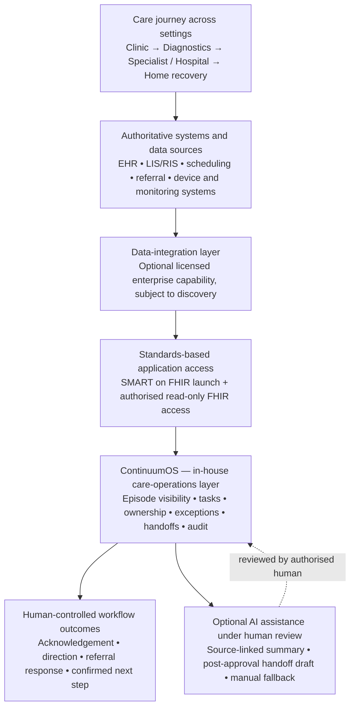
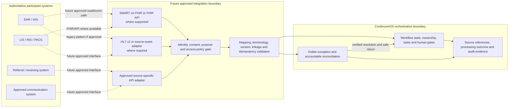

# Sprint 4 — Architecture Principles and Boundary

## Purpose and evidence status

This artifact defines the architecture boundary for the ContinuumOS Diagnostic Closure and Care Escalation MVP. It is the governing Sprint 4 architecture policy and a proposed design for a synthetic portfolio demonstration. The simplified architecture, SMART sequence, event catalogue, AI service cards, audit design and later prototype/UAT work must derive from it without creating new scope. It does not claim a live EHR integration, production interoperability, production security, enterprise scale, clinical validation, deployed AI or achieved outcomes.

The inherited Sprint 1–3 product, workflow, decision-rights, data and scope baseline remains authoritative. Sprint 4 may make the design technically understandable, but it must not expand the frozen MVP through architecture wording.

## Architecture objective

The architecture must support one synthetic episode from a verified diagnostic order through result availability, human acknowledgement, human follow-up direction, operational handoff, receiving-team response, confirmation of the next safe care step and auditable completion of the scoped workflow.

ContinuumOS remains a vendor-neutral orchestration overlay. Source systems remain authoritative for patient, encounter, diagnostic, referral, communication and financial records. ContinuumOS owns only its internal episode linkage, workflow state, tasks, exceptions, evidence references, communication status and workflow history.

## Inherited authority and dependency order

If architecture wording conflicts with an inherited artifact, use this order:

1. accepted Product Case Charter;
2. approved Sprint 1 Decision Register entries;
3. Sprint 2 Canonical Alignment Register;
4. Sprint 1 state model and transition table;
5. Sprint 2 workflow, ownership, decision-rights, system-of-record and failure-path artifacts;
6. frozen Sprint 3 baseline, MVP scope, integration, FHIR, field and permission artifacts;
7. Sprint 4 artifacts, unless an approved change is recorded and propagated to every affected source.

## Architecture principles

| ID | Principle | Required architecture behaviour | Prevented misinterpretation |
|---|---|---|---|
| AP-01 | Overlay, not replacement | Read minimum required synthetic source data and maintain separate internal orchestration records. | ContinuumOS is not an EHR, longitudinal clinical repository or source-system replacement. |
| AP-02 | Source authority is preserved | Keep source identifiers, versions, timestamps and provenance. A ContinuumOS status never overwrites or silently corrects a source record. | Internal workflow visibility is not clinical or administrative source truth. |
| AP-03 | Verified linkage before attachment | Verify Patient, Encounter and event linkage before creating or advancing a valid episode. The later linkage contract must define required identifiers, acceptable source references, Encounter requirements, version handling, permitted manual reconciliation and the accountable resolver. Manual reconciliation may establish an internal reference but cannot silently alter the source identity or encounter record. | Match confidence, AI output, identifier similarity or manual workflow recording cannot silently attach an event or rewrite source identity. |
| AP-04 | Canonical workflow only | Use the 13 approved core states and 10 approved exception states exactly. Reason-coded conditions do not become new states without approved change control. | Architecture components and messages cannot create near-duplicate workflow states. |
| AP-05 | Evidence-gated transitions | Every state change requires approved source evidence, an authorised human action or an approved deterministic rule outcome. For the approved synthetic fixture, `Result Available` requires an accepted current DiagnosticReport status (`final`, `amended` or `corrected`), the current source version, resolution of the configured required result references and the separate source-specific completion evidence. Observation or preliminary/partial evidence alone is insufficient. | Resource presence, message receipt, Observation presence or task completion alone does not prove a complete result or human decision. |
| AP-06 | Human authority is not delegated | Preserve human control for clinical review, acknowledgement, care direction, referral or escalation approval, receiving-team response, patient-facing clinical content approval, financial authorisation and closure verification. | A workflow service, rule or AI output cannot substitute for an accountable human. |
| AP-07 | Rules and AI remain distinct; AI is optional to progression | Use deterministic rules for missing owner, overdue work, missing handoff evidence, duplicate/incomplete data and service availability. Limit MVP AI to the source-linked episode summary and source-linked referral-handoff draft after human approval. Failure, timeout or unavailability of AI support falls back to source evidence and the normal human workflow. AI output is never a prerequisite for acknowledgement, care direction, handoff, receiving response or closure. | Predictable controls are not presented as AI; AI does not diagnose, prioritise, decide or become a blocking workflow dependency. |
| AP-08 | Least privilege by workflow job | Separate minimum source reads, internal workflow writes, human-decision writes, represent-only statuses, audit review and technical recovery. | Broad role access or technical administration does not grant decision authority. |
| AP-09 | Safe failure before progression | Keep failures visible, preserve the last verified valid state and route uncertainty to the exception queue and accountable resolver. | Failed writes, outages or incomplete data cannot be treated as successful progression. |
| AP-10 | Idempotent and attributable processing | Correlate events to the synthetic episode, retain source event/resource ID and version, prevent duplicate advancement and record actor, outcome and recovery evidence. | Replayed or duplicated events cannot advance the episode twice. Detailed event keys are defined in `event_catalogue_and_recovery_rules.md`. |
| AP-11 | Audit and correction by design | Record material source events, state changes, human decisions, AI reviews, corrections, exceptions and recovery actions as append-oriented, attributable and tamper-evident history. Corrections create linked correction or superseding entries rather than destructively editing earlier evidence. | The behaviour is a target requirement, not an implemented control; append-oriented correction does not mean source truth can be overwritten. |
| AP-12 | Demonstration scale is explicit | Use a limited SMART on FHIR demonstration, synthetic data and simulated integrations. Label production identity, consent, security, conformance and scaling controls as future readiness. | The diagram cannot be read as a deployed regional or production architecture. |
| AP-13 | Minimum necessary data | Retrieve, display, provide to AI and retain only the synthetic fields required for the scoped workflow, evidence trace and evaluation. Reference source records where possible; do not copy complete source clinical records into the orchestration store. | Read permission does not make ContinuumOS a duplicate clinical or longitudinal repository. |
| AP-14 | Analytics is read-only and derived | Derive measures from approved workflow/audit evidence with visible definitions, exclusions and missingness. Metrics may inform review but cannot create tasks, change state, invoke AI, send communication or make a decision. | A metric, threshold or dashboard cannot become an undocumented workflow-control mechanism. |

## MVP architecture boundary

## Integrated-care-network positioning

This diagram is a conceptual reading aid for the portfolio case. It separates the care-network operating model, possible licensed data-integration capability, standards-based application access and the ContinuumOS workflow layer. It is not a deployment diagram, procurement plan or claim that any named operator or vendor is connected to ContinuumOS.

### Layer boundaries

| Layer | Role in the case | Boundary |
|---|---|---|
| Care-network operating model | Provides the clinic-to-home context in which continuity matters. | The MVP remains one synthetic diagnostic-closure episode; it does not implement a whole network. |
| Data-integration layer | May connect device and operational data with enterprise information systems where an organisation licenses and validates a suitable capability. | No platform, procurement, interface or compatibility claim is made in this portfolio case. |
| SMART on FHIR | Provides the chosen simulated clinician launch and authorised, read-only FHIR access pattern. | It is not a live EHR connection, production OAuth implementation or source write-back channel. |
| ContinuumOS | Owns internal orchestration visibility, tasks, exceptions, evidence and audit history. | It is not the EHR, LIS/RIS, device platform or primary clinical record. |
| AI assistance | Provides only the two approved source-linked drafts under human review. | It cannot make clinical, identity, referral, financial or closure decisions. |

### Build, buy, partner and adopt boundary

| Capability | Portfolio decision | Boundary |
|---|---|---|
| ContinuumOS workflow, task, exception and audit experience | Build as the differentiated workflow layer | Limited to the approved synthetic prototype and internal workflow evidence. |
| Synthetic FHIR fixtures and simulated SMART launch | Build for the portfolio prototype | Demonstrates a bounded access pattern only; it is not a live integration. |
| Production EHR, LIS/RIS, identity, consent and clinical-record integrations | Partner or procure later | External systems remain authoritative; discovery, procurement and local approvals are future work. |
| Enterprise data-integration capability | Potential licensed partner capability | Vendor selection, compatibility and procurement are not decided or claimed. |
| SMART on FHIR | Adopt as the interoperability pattern | The prototype simulates authorised read-only access; production conformance remains future readiness. |
| Foundation AI model or API | Consume later through an approved service if separately authorised | The prototype does not train, select, call or evaluate a production model. |
| AI summary and handoff draft controls | Build the workflow, review, traceability and evaluation layer | AI output remains optional, source-linked and subject to human review and manual fallback. |

### openEHR research influence and selected boundary

The user's earlier research was influenced by openEHR concepts, particularly durable structured clinical information and separation of clinical models from application logic. ContinuumOS does not implement those concepts as an openEHR Clinical Data Repository, archetype/template stack or conformance claim. The selected MVP problem is workflow continuity around authoritative source records, so simulated SMART on FHIR and limited FHIR R4-shaped reads are the proportionate application-access boundary. A longitudinal repository remains a separately governed future product and architecture decision, recorded as TDR-16.

### Included in the Sprint 4 MVP design

- simulated clinician SMART launch with verified synthetic Patient and Encounter context;
- read-only retrieval of minimum synthetic FHIR R4 data for Patient, Encounter, Practitioner, ServiceRequest, Observation and DiagnosticReport;
- internal ContinuumOS episode, workflow-state, task, ownership, SLA, exception and evidence records;
- internal/simulated orchestration Task model, not claimed to be FHIR R4-conformant;
- deterministic missing-owner, overdue, missing-handoff, duplicate, incomplete-data and unavailable-service controls;
- source-linked episode-summary support with human review;
- source-linked referral-handoff draft only after human-approved referral or escalation direction;
- non-blocking fallback to source evidence and normal human workflow when AI support is unavailable;
- internal workflow and audit evidence for human decisions, AI review, exceptions, recovery and closure;
- minimum-necessary synthetic data retrieval and internal retention, with complete source records referenced rather than copied;
- metrics derived from workflow evidence, without invented baselines, targets or results.

### Represented but not implemented as complete integrations

- diagnostic acceptance, scheduling and completion events from simulated operational sources;
- referral routing and receiving-team response evidence;
- communication approval, sending and delivery/receipt evidence;
- financial-readiness, missing-information and denial statuses, including the approved D12/T11U urgent-escalation branch, where clinically urgent escalation may proceed through authorised human action while financial readiness remains visible as a separately owned dependency;
- source-write denial, workflow-service outage and recovery to the last verified state;
- amended reports, duplicate events, incomplete results and reconciliation work;
- future HL7 v2 ADT/ORU-like input patterns mapped to existing resources and canonical transitions.

### Future legacy and API integration reference pattern

This is a future-readiness pattern for discussing how a participating organisation might connect authoritative systems after discovery and approval. It does not select an interface, vendor, integration engine, transport, deployment topology or write-back scope.

Before any real interface is designed, discovery must establish:

- the authoritative source and owner for each status, decision and correction;
- available standards, versions, profiles, message types, endpoints and vendor constraints;
- identity, encounter, consent, purpose-of-use and workforce-access policy;
- terminology mapping, report-version handling and minimum necessary fields;
- batch, polling or event-delivery behavior, ordering, retry and idempotency expectations;
- read, write and acknowledgement boundaries, including who may correct source data;
- outage, reconciliation, monitoring, support and escalation ownership; and
- retention, audit, security, data-residency and participant exit requirements.

The reference pattern does not authorise source write-back. A future write path would require its own product decision, accountable source owner, API contract, safety analysis, conformance evidence and participant approval.

### Deferred or future architecture context

- live EHR, LIS, RIS/PACS, referral, payer, communication or device integrations;
- production OAuth, identity provider, consent, MPI, RBAC/ABAC, secret management and security certification;
- real FHIR Task write-back, source clinical correction or source administrative write workflows;
- production event streaming or processing using Kafka, Flink or similar platforms;
- Spark or other production analytics platforms;
- openEHR or another longitudinal clinical repository;
- real AI model calls, model training, autonomous anomaly detection or production model operations;
- multi-hospital command centre, capacity optimisation, surgery, discharge and home recovery.

## Read and write boundary

| Information area | Authoritative source | ContinuumOS permitted use | ContinuumOS prohibited use |
|---|---|---|---|
| Patient and encounter | Source identity and encounter context | Minimum read; verified internal references; reconciliation exception | Autonomous matching, source correction or inferred encounter creation |
| Diagnostic order and results | EHR/order source, LIS or RIS/PACS/reporting source | Minimum read; source-linked display; version-aware workflow evidence | Clinical order, Observation or DiagnosticReport authoring/correction |
| Diagnostic operational status | Diagnostic operational source or simulated event | Record referenced acceptance, scheduling and completion evidence | Infer acceptance or scheduling from ServiceRequest; infer completion from report status |
| Human decisions | Accountable human role and approved source/workflow action | Record attributable decision evidence and resulting internal state | Manufacture, infer or delegate the decision to AI or rules |
| Referral and receiving response | Referral or receiving-team source | Track approved package, route and external response evidence | Autonomous referral approval, acceptance, rejection or redirection |
| Patient communication | Approved communication record or authorised sender | Track preparation, approval, send attempt, delivery evidence, failure, follow-up and explicit confirmation where required | Treat sent or delivered as proof that the patient understood or accepted the next step |
| Financial readiness | Authorised financial or administrative source | Display represent-only dependency and status evidence | Coverage inference, payer decision or autonomous financial authorisation |
| Workflow tasks and exceptions | ContinuumOS | Create and update internal orchestration records under role controls | Treat task completion as proof of a clinical, referral or financial decision |
| Audit history | ContinuumOS workflow history plus source references | Append attributable target evidence and preserve corrections/recovery | User editing/deletion or a claim of implemented immutability without evidence |

## Human, deterministic and AI control boundary

| Control type | Allowed behaviour | Required owner or reviewer | Prohibited behaviour |
|---|---|---|---|
| Human decision | Review, acknowledge, choose direction, approve content, accept/reject handoff, authorise finances and verify closure within assigned authority | Canonical accountable role for that decision | Authority transfer through system access, task ownership or technical administration |
| Deterministic workflow rule | Validate required fields, detect missing owner/overdue/missing handoff/duplicate/incomplete/unavailable conditions, create visible work and block unsafe progression | Care Coordinator or exception-specific resolver acts on the output; administrator handles technical recovery | Acknowledge, diagnose, choose a path, accept a referral, authorise finances or close without evidence |
| AI-assisted output | Produce a source-linked summary or post-approval referral-handoff draft with provenance, version context and uncertainty; fall back to source evidence and normal human workflow on failure or timeout | Clinic physician, Care Coordinator or Referral Coordinator as defined by the approved use | Patient matching, diagnosis, prioritisation, acknowledgement, referral approval/routing, receiving acceptance, financial decision, independent state change, closure or blocking valid human progression |

## Failure and recovery contract

The architecture must preserve the approved pattern:

`uncertain or failed input → visible exception/pending state → accountable human or technical reconciliation → verified safe return`

It must never become:

`uncertain or failed input → silent attachment or assumed success → normal progression`

For outage or denied-write recovery, the episode returns to the last verified valid state. A restored service does not replay an unverified action or advance the episode twice. `event_catalogue_and_recovery_rules.md` defines the correlation and deduplication keys for each event type.

AI-support failure is handled differently from loss of a required workflow or source service: record the failed or unavailable assistive request, keep the source evidence accessible and continue the authorised human workflow. Do not create a false AI output or require AI recovery before an otherwise valid human action.

## Report-version change and re-review contract

- A first current report may satisfy T04 only when the approved synthetic-fixture rule is met: accepted current status (`final`, `amended` or `corrected`), current source version, configured required-reference resolution and separate source-specific completion evidence.
- An amended or corrected report received before acknowledgement still follows E05/E06: it becomes the current review version and requires the clinician's acknowledgement. There is no earlier acknowledgement to carry forward.
- An amended or corrected report received after acknowledgement preserves the earlier acknowledgement as historical evidence only. It invalidates reliance on that acknowledgement for the new version and requires renewed clinical review and acknowledgement before downstream clinical progression.
- A deterministic control flags any follow-up direction, referral handoff or patient communication based on the superseded version for human reassessment. It does not automatically cancel, redirect or resend anything.
- The amended/corrected version and the reassessment outcome must be attributable in workflow and audit evidence. An AI summary or draft may be regenerated for review but cannot decide whether the downstream content remains appropriate.

## Minimum closure evidence

`Episode Completed` requires all applicable evidence below:

- recorded human disposition;
- required handoff completed or explicitly marked not applicable;
- accountable next-step owner identified where applicable;
- receiving-team response recorded where required;
- required patient communication and any explicit confirmation evidence recorded separately;
- no unresolved safety-blocking exception;
- accountable closer and timestamp; and
- source and workflow evidence references.

A deterministic rule may test completeness and keep missing evidence visible, but a human-owned closure action remains required. Sent or delivered communication alone does not prove patient understanding or acceptance when explicit confirmation is required.

## Initial Sprint 4 architecture decisions

| Decision ID | Decision | Status and rationale |
|---|---|---|
| S4-AD01 | Use a small logical layered architecture for the portfolio demonstration rather than a production microservice topology. | Proposed design baseline. It explains responsibilities without implying deployment scale. |
| S4-AD02 | Keep source access read-only for the limited SMART/FHIR demonstration; write internal workflow, task, exception and audit evidence only. | Inherited boundary from Sprint 3. Any source write requires separate approval and evidence. |
| S4-AD03 | Model the internal orchestration Task separately from FHIR R4 source resources. | Inherited boundary. The internal record is not claimed to be FHIR R4-conformant. |
| S4-AD04 | Use synchronous simulated reads for launch/context retrieval and simulated event arrival for workflow progression; do not introduce an enterprise event broker into the MVP. | Proposed demonstration design. Detailed event timing and idempotency remain for the event catalogue. |
| S4-AD05 | Keep deterministic controls in the workflow layer and the two approved assistive capabilities in a separate AI-support boundary. | Preserves D05/D06 and avoids misclassifying missing-handoff detection as AI. |
| S4-AD06 | Treat append-oriented, attributable and tamper-evident audit history with linked correction entries as a target requirement, not achieved implementation evidence. | Preserves the Sprint 3 audit evidence-status correction while defining non-destructive correction behaviour. |
| S4-AD07 | Treat AI support as optional to canonical progression and fall back to source evidence and the normal human workflow when it fails or times out. | Formalises the assistive boundary; record the failure but do not block valid human work. |
| S4-AD08 | For the approved synthetic fixture, require an accepted current DiagnosticReport status (`final`, `amended` or `corrected`), the current source version, resolution of configured required result references and separate source-specific completion evidence before `Result Available`; apply E05/E06 version-change and re-review controls whenever an amended/corrected version arrives. | Formalises fixture completion evidence, not a universal FHIR constraint. Observation or preliminary/partial evidence alone is insufficient; missing/conflicting configured evidence routes to `Result Incomplete`; prior acknowledgement cannot satisfy an amended/corrected version. |
| S4-AD09 | Apply minimum-necessary data to source reads, internal stores, audit payloads and AI inputs. | Preserves the overlay model and prevents creation of a duplicate clinical repository. |
| S4-AD10 | Separate communication delivery status from patient understanding/acceptance and require pathway-specific closure evidence before human-owned completion. | Prevents notification delivery from being treated as next-step confirmation or closure. |
| S4-AD11 | Use append-oriented, attributable audit evidence with linked correction/superseding entries rather than destructive edits. | Defines correction behaviour while retaining the target, not-implemented evidence status. |
| S4-AD12 | Make the clinician workspace the only SMART-launched demonstration path; use separate role-authorised access for operations. | Preserves the access-mode distinction and prevents SMART from being implied as the universal operations gateway. |
| S4-AD13 | Define a synthetic FHIR-shaped fixture set for the six source resources and a separate internal/simulated orchestration Task. | Makes the data boundary executable in later demonstration work without claiming live FHIR conformance or Task write-back. |
| S4-AD14 | Keep audit append-oriented and make derived analytics read-only, versioned and non-triggering. | Preserves attributable workflow history and prevents a metric threshold from becoming a hidden workflow or AI decision rule. |

## Alignment checks for later Sprint 4 work

Every later component, interface, event, AI output, data field and analytics measure must answer:

1. Which frozen MVP capability does it support?
2. Which canonical state, transition or exception does it affect?
3. Which source remains authoritative?
4. Which human role owns any material decision?
5. Is the behaviour human, deterministic, AI-assisted or represent-only?
6. What happens when data is missing, duplicate, amended, mismatched or unavailable?
7. Is it build-now demonstration scope, represent-only or future architecture context?
8. What audit evidence is required without implying implementation?

## Source trace

- `00_Project_Charter/product_case_charter.md`
- `01_Day_1_Product_Framing/decision_register.csv` — D01–D18
- `01_Day_1_Product_Framing/state_transition_table.csv`
- `Sprints/Sprint_2_Care_Journey_and_Operating_Model/canonical_alignment_register.md`
- `Sprints/Sprint_2_Care_Journey_and_Operating_Model/mvp_operating_control_table.md`
- `Sprints/Sprint_2_Care_Journey_and_Operating_Model/system_of_record_table.csv`
- `Sprints/Sprint_2_Care_Journey_and_Operating_Model/failure_path_map.md`
- `Sprints/Sprint_3_Users_Decisions_and_MVP/sprint_3_baseline_and_alignment.md`
- `Sprints/Sprint_3_Users_Decisions_and_MVP/mvp_scope_freeze.md`
- `Sprints/Sprint_3_Users_Decisions_and_MVP/integration_flow_ehr_launch_to_audit.md`
- `Sprints/Sprint_3_Users_Decisions_and_MVP/fhir_resource_map.md`
- `Sprints/Sprint_3_Users_Decisions_and_MVP/field_mapping.csv`
- `Sprints/Sprint_3_Users_Decisions_and_MVP/permissions_and_interoperability_assumptions.md`
- `Sprints/Sprint_3_Users_Decisions_and_MVP/decision_rights_and_ai_suitability_matrix.csv`
