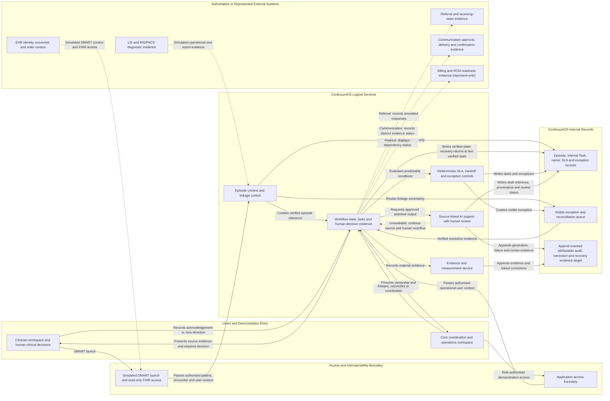
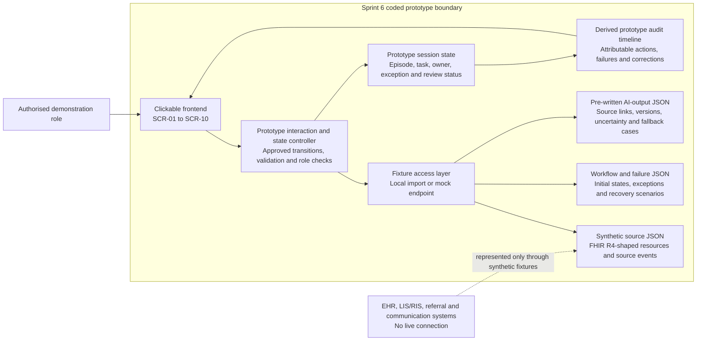

# Sprint 4 — Simplified MVP Architecture

## Purpose and evidence status

This diagram is a logical architecture for the synthetic ContinuumOS Diagnostic Closure and Care Escalation demonstration. It shows responsibility and data-flow boundaries, not a deployed topology. External integrations, production identity/security controls, enterprise event streaming and production AI are not implemented.

This diagram derives from `architecture_principles_and_boundary.md`. Where the diagram is ambiguous or appears to conflict with that governing file or an inherited canonical artifact, the architecture principles and inherited authority order govern. Later Sprint 4 SMART, event, AI, audit and readiness artifacts must implement both without creating new scope.

## Logical architecture diagram

## Sprint 6 prototype runtime architecture

This implementation view clarifies how the coded clickable prototype may demonstrate the approved behaviour without a live hospital connection, production backend or real AI service. It is a build guide for Sprint 6, not evidence that the prototype has been implemented.

| Prototype element | What is implemented | What is simulated or excluded |
|---|---|---|
| Frontend | Real clickable screens, navigation, role-visible actions, validation, loading/error feedback and failure recovery. | No claim of production usability, clinical validation or enterprise deployment. |
| Interaction and state controller | Deterministic prototype logic for approved state changes, blocks, duplicate protection and safe return. | It is not a production workflow engine or source-system transaction processor. |
| Fixture access layer | Reads project-controlled JSON through local imports or a mock endpoint chosen during implementation. | It is not a hospital API gateway, integration engine or live backend. |
| Source and workflow fixtures | Synthetic FHIR R4-shaped resources, events, tasks, exceptions and scenario variants. | No real patient data, EHR/LIS/RIS connection, source write-back or interoperability conformance claim. |
| AI fixtures | Pre-written source-linked summary and handoff-draft outputs, including stale, unsafe, unavailable and fallback examples. | No model call, training, inference, autonomous action or model-performance claim. |
| Session and audit evidence | Prototype state and visible, attributable event history sufficient to demonstrate the approved scenarios. | No production database, immutable ledger, retention control or operational monitoring claim. |

The essential behavior must remain understandable without the diagram: a real interactive frontend reads synthetic JSON, applies approved deterministic controls, displays pre-written AI drafts for human review and records visible prototype evidence. No external system or AI service is contacted.

## Layer responsibilities

| Layer | MVP responsibility | Explicit boundary |
|---|---|---|
| Users and demonstration entry | Provide a simulated SMART entry for the clinician and separate role-authorised demonstration access for operations; make material human actions visible. | Operations access is not assumed to be SMART-launched. Access does not transfer clinical, referral, identity or financial authority. |
| Access and interoperability | Accept simulated SMART context for the clinician, enforce candidate minimum read-only access and pass only approved minimum synthetic fields. | No live OAuth, production identity-provider integration, source write scope or raw-token storage is claimed. Full source records are referenced or displayed from scoped synthetic payloads, not copied as a longitudinal record. |
| Episode context and linkage | Retrieve minimum source context, preserve source IDs/versions and block uncertain Patient, Encounter or event attachment. | The later linkage contract defines identifiers, Encounter requirements, version handling, manual reconciliation and the accountable resolver. Uncertainty routes to `Patient Match Failed`, `Encounter Missing` or the appropriate exception; no AI matching or silent source correction. |
| Workflow state and tasks | Maintain canonical state, internal Task records, owners, SLA, blockers, AI draft/review status, evidence checklists and attributable human-decision records. | Internal workflow state is not source clinical or administrative truth; complete source documents are not copied into the orchestration store. |
| Deterministic controls | Detect missing owner, overdue work, missing handoff evidence, duplicate/incomplete data and unavailable service; create visible work or block progression. | Rules cannot acknowledge, choose a path, accept a referral, authorise finances or close without human evidence. |
| AI support | Provide the source-linked episode summary and the source-linked referral-handoff draft after human-approved direction using only approved scoped inputs. Store the draft reference, provenance and review state as internal workflow evidence. | Failure, timeout or unavailable output falls back to the source report and normal human workflow. AI does not block a valid human decision or transition. No diagnosis, prioritisation, identity matching, autonomous referral routing, source write or state transition; real model calls remain deferred. |
| Exception and safe return | Keep uncertain or failed work visible with an owner, reason, prohibited action and safe-return condition. | Resolution requires attributable evidence and returns only to the last verified valid state; no silent attachment, assumed success or duplicate advancement. |
| Evidence and measurement | Append attributable source, workflow, human-decision, AI-review/failure, exception, correction and recovery evidence; derive approved metrics from that evidence. | Corrections are linked entries, not destructive edits. Metrics do not change workflow state and do not become source truth. Tamper evidence is a target requirement, not an implemented control. |
| External systems | Remain authoritative for identity, encounter, orders, results and separately represented referral, communication and financial evidence. | The diagram does not claim live EHR, diagnostic, referral, payer or communication integration. Communication delivery does not prove patient understanding or acceptance. |

## Main MVP information path

1. A clinician enters through the simulated SMART launch using synthetic Asha Mehta context (`SYN-PAT-1001`).
2. The SMART boundary receives simulated EHR launch context and retrieves only approved minimum read-only FHIR R4 fields. Operations enters through a separate role-authorised demonstration path.
3. Episode context and linkage control applies the defined linkage contract to Patient, Encounter and event references before attachment; authorised manual reconciliation may establish an internal reference without changing the source record.
4. The workflow service records a canonical state and creates internal orchestration work with owner, SLA, blocker and evidence requirements.
5. Deterministic controls surface missing, overdue, duplicate, incomplete or unavailable conditions without making human decisions.
6. The workflow presents source evidence and required actions to the authorised clinician or operations user; the human action, not a service inference, supplies the material decision evidence.
7. Approved AI support may create a source-linked summary or, after human-approved referral/escalation direction, a source-linked handoff draft for review. AI failure is recorded and the source-based human workflow continues.
8. Material events, human decisions, AI generation/failure/review, exceptions, linked corrections and recovery actions produce append-oriented attributable evidence. Approved metrics are derived separately and cannot change state.
9. Referral, communication and financial-readiness statuses are represented as distinct simulated/external evidence. Sent or delivered communication does not prove understanding or acceptance. Under the approved D12/T11U urgent branch, authorised clinically urgent escalation may proceed while unresolved financial readiness remains visible as a separately owned dependency.

## Source, internal and future classification

| Diagram element | Classification | Reason |
|---|---|---|
| Simulated SMART launch and read-only FHIR access | Designed demonstration boundary | Required by the frozen MVP; exact executable evidence is established by later implementation and testing. Live EHR integration remains deferred. |
| Patient, Encounter, Practitioner, ServiceRequest, Observation and DiagnosticReport reads | Demonstrated through synthetic FHIR-shaped resources or a limited test read, depending on later implementation evidence | These are the six approved source FHIR R4 resource types. A mocked JSON response is simulated data, not a completed FHIR integration. |
| Episode, workflow, internal Task, ownership, SLA, exception and audit records | Build-now internal design | ContinuumOS owns orchestration visibility and history, not source records. |
| Diagnostic operational events | Simulated/represented input | Acceptance, scheduling and completion require operational evidence and cannot be inferred from ServiceRequest. |
| Referral and receiving-team evidence | Internal workflow evidence with simulated external interaction | Human approval, routing and acceptance/rejection remain role-controlled and distinct from patient communication. |
| Communication approval, delivery and confirmation evidence | Internal workflow evidence with simulated external interaction | Preparation, approval, send, delivery, failure, follow-up and explicit confirmation are distinct; delivery does not prove understanding or acceptance. |
| Billing/RCM and financial readiness | Represent-only | No payer integration, coverage inference, claims or authorisation workflow is built. |
| HL7 v2, regional HIE, Kafka, Flink, Spark and openEHR | Future architecture context only | They are not required to demonstrate the MVP and must not appear as implemented components. |

## Result, communication and closure evidence

- For the approved synthetic fixture, `Result Available` requires an accepted current DiagnosticReport status (`final`, `amended` or `corrected`), the current source version, resolution of the configured required result references and the separate source-specific completion evidence. Observation or preliminary/partial evidence alone is insufficient; missing or inconsistent configured evidence routes to `Result Incomplete`.
- Communication preparation, approval, send attempt, delivery, failure, follow-up and explicit confirmation are separate evidence states. Sent or delivered does not prove patient understanding or acceptance.
- `Episode Completed` requires the governing minimum closure evidence: human disposition, applicable handoff/receiving response, next-step owner, required communication/confirmation evidence, no unresolved safety-blocking exception, accountable closer/timestamp and source/workflow references.
- Deterministic controls may test completeness, but a human-owned closure action remains required.

## Data and audit constraints

- Retrieve, display, retain and provide to AI only approved minimum synthetic fields.
- Reference complete source records where possible; do not copy them into a longitudinal ContinuumOS repository.
- Store AI draft reference, provenance, uncertainty and review status as active internal workflow evidence; represent approved handoff content separately.
- Store audit events as append-oriented attributable evidence. Corrections create linked correction or superseding entries.
- Prototype implementation may simulate this evidence structure; tamper evidence is not claimed.
- Never retain raw access tokens, secrets or full authorisation responses.

## Diagram controls that must carry into later artifacts

- Exact SMART launch steps and candidate scopes must be defined in the next sequence artifact.
- The SMART sequence must keep clinician SMART launch separate from operations demonstration access and preserve actor/context attribution.
- Exact event IDs, correlation keys, duplicate rules and recovery rules are defined in `event_catalogue_and_recovery_rules.md`.
- The event catalogue must implement complete-result evidence, communication-state separation, AI failure fallback, linkage verification and linked audit corrections.
- AI input/output, uncertainty, reviewer and approval controls are defined in `ai_service_cards_and_control_matrix.md`.
- Production consent, identity, security, terminology, conformance and HIE readiness must remain future-readiness checklist items.
- No later architecture artifact may bypass the exception queue, human decision gates, source authority or last-verified-state recovery rule shown here.

## Source trace

- `Sprints/Sprint_4_Architecture_and_AI_Operating_Model/architecture_principles_and_boundary.md`
- `Sprints/Sprint_3_Users_Decisions_and_MVP/sprint_3_baseline_and_alignment.md`
- `Sprints/Sprint_3_Users_Decisions_and_MVP/mvp_scope_freeze.md`
- `Sprints/Sprint_3_Users_Decisions_and_MVP/integration_flow_ehr_launch_to_audit.md`
- `Sprints/Sprint_3_Users_Decisions_and_MVP/fhir_resource_map.md`
- `Sprints/Sprint_3_Users_Decisions_and_MVP/field_mapping.csv`
- `Sprints/Sprint_3_Users_Decisions_and_MVP/permissions_and_interoperability_assumptions.md`
- `Sprints/Sprint_2_Care_Journey_and_Operating_Model/system_of_record_table.csv`
- `Sprints/Sprint_2_Care_Journey_and_Operating_Model/failure_path_map.md`
- `01_Day_1_Product_Framing/decision_register.csv`
- `01_Day_1_Product_Framing/state_transition_table.csv`
