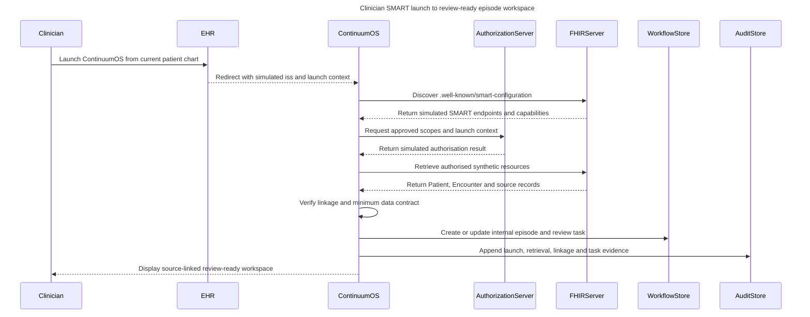

# Sprint 4 — Clinician SMART launch to review-ready episode workspace

## Purpose and evidence status

This requirements-level sequence describes the limited clinician-facing SMART on FHIR demonstration using synthetic Asha Mehta data (`SYN-PAT-1001`) and simulated source access. It models SMART discovery, authorisation and authorised FHIR retrieval without claiming a live EHR launch, production OAuth/token handling, endpoint conformance, production security, FHIR write-back or successful implementation.

The clinician workspace is the only SMART-launched path in this demonstration. The care-coordination/operations workspace uses separate role-authorised demonstration access and must not be described as automatically SMART-launched.

## Sequence diagram

## Launch contract

| Step | Required behaviour | Human/source control | Failure stop and recovery | Evidence captured |
|---|---|---|---|---|
| 1. Launch parameters | Simulated EHR redirect provides `iss`, `launch`, clinician context and the synthetic patient/encounter context for Asha Mehta. The launch payload is context, not a bundle of source resources. | EHR context is authoritative for supplied launch identifiers. | Missing or inconsistent launch parameters stop protected retrieval; no episode attachment. | Access mode, actor, role, source, time, non-sensitive identifiers and correlation ID. |
| 2. SMART discovery | Construct the discovery URL from the FHIR base and retrieve simulated `.well-known/smart-configuration` capability metadata. | Server capability metadata governs candidate endpoints/scopes for the demonstration. | Discovery unavailable or malformed stops authorisation and records a pending access failure. | FHIR base, discovery outcome, capability version and correlation ID. |
| 3. Authorisation request | Request `launch` plus only the candidate read-only scopes below, echoing the launch identifier in the simulated authorisation request. | No write scope is proposed; ContinuumOS cannot alter source clinical or administrative records. | Authorisation denial, token-exchange failure or expired authorisation stops retrieval without retaining raw credentials. | Requested/granted scope set, outcome, time, source and non-sensitive correlation ID. |
| 4. Authorised resource retrieval | Use the authorised simulated FHIR access path to retrieve the minimum approved Patient, Encounter, Practitioner, ServiceRequest, Observation and DiagnosticReport fields. | Source systems remain authoritative; `ServiceRequest` supports order evidence only. | FHIR 401/403, unavailable endpoint, malformed data or incomplete response stops normal progression and routes to the applicable exception or pending condition. | Resource type, source ID, version, retrieval mode, query/correlation ID, minimum retrieved fields and timestamp. |
| 5. Linkage verification | Check required Patient, Encounter and event references against the linkage contract before attaching the internal episode. `fhirUser` maps only to the reviewing clinician, not the reporting professional. | Identity reconciliation reviewer resolves uncertain linkage; manual reconciliation may establish an internal reference but cannot alter source identity or encounter records. | Route to `Patient Match Failed` or `Encounter Missing`; return only after verified resolution. | Matching inputs, rule result, reviewer, recording actor, resolution, source references and safe-return state. |
| 6. Result evidence | For the approved synthetic fixture, `Result Available` requires an accepted current DiagnosticReport status (`final`, `amended` or `corrected`), the current source version, resolution of the configured required result references and the separate source-specific completion evidence. Observation or preliminary/partial evidence alone is insufficient. | Diagnostic operations confirms source completion evidence; reporting professional owns source report finalisation/amendment; clinician review remains separate. | Missing/inconsistent fixture evidence routes to `Result Incomplete`; no acknowledgement obligation is created from incomplete evidence. | Report status/version, `basedOn`, configured result-reference check, source completion evidence, validation outcome and state candidate. |
| 7. Orchestration and audit | Create/update the internal episode, canonical state, owner/SLA and internal/simulated Task evidence; append launch, retrieval, linkage, task and failure/recovery evidence. | ContinuumOS owns orchestration visibility, tasks, exceptions and workflow history, not source records. | Failed internal write remains pending/failed; recover to the last verified valid state. Corrections append linked entries. | Episode/task reference, canonical state, owner, SLA, blocker, source references, audit ID, state before/after and outcome. |

## Candidate minimum SMART scopes

These are candidate read-only scopes for the synthetic demonstration, not a production technical configuration:

`launch`, `openid`, `fhirUser`, `patient/Patient.r`, `patient/Encounter.r`, `patient/ServiceRequest.rs`, `patient/Observation.rs`, `patient/DiagnosticReport.rs`, `user/Practitioner.r`

`fhirUser` identifies the signed-in reviewing clinician. Practitioner access is user-context access, not patient-compartment access; the reporting professional is source evidence and is not assumed to be the signed-in user. Use `.r` for direct reads and `.rs` only where patient-scoped search is required. Exact scopes remain subject to server capability discovery and implementation validation.

No `write` scope is proposed. Raw tokens, secrets and full authorisation responses must never be stored in workflow or audit records.

## Retrieval classification

| Information | Retrieval route | Demonstration use |
|---|---|---|
| `iss`, launch identifier, patient/encounter launch context | EHR launch parameters | Start authorised context; never treat as complete source data. |
| SMART endpoints and supported capabilities | `.well-known/smart-configuration` discovery | Select the simulated authorisation/retrieval path. |
| Signed-in reviewing clinician | `fhirUser`, then direct `user/Practitioner.r` if needed | Attribute clinician workspace/review task. |
| Patient and known encounter | Authorised direct read | Verify minimum episode context. |
| ServiceRequest, Observation and DiagnosticReport evidence | Authorised patient-scoped search or direct read where identifier is known | Supply approved source-linked workflow evidence. |

## Separate operations access

The operations workspace is entered through a separate role-authorised demonstration access path. It receives only the internal workflow context and minimum source-linked data allowed for the Care Coordinator or relevant operational role. Its actor, role, session/correlation identifier and access mode are recorded separately from the clinician SMART launch.

Operations access does not grant clinical acknowledgement, pathway selection, identity matching, receiving-team acceptance or financial-authorisation authority. Role access enables coordination; it does not transfer decision rights.

## Protected retrieval and failure rules

| Failure | Immediate behaviour | Human recovery | Prohibited behaviour |
|---|---|---|---|
| Invalid or incomplete launch parameters | Stop protected retrieval; keep the episode unattached. | Identity reconciliation reviewer or source owner verifies context. | Infer a patient or encounter from partial identifiers. |
| SMART discovery unavailable or malformed | Stop authorisation; show a safe pending/error condition. | Product/platform administrator verifies source configuration. | Invent endpoints or continue as though SMART capability was confirmed. |
| Authorisation denied | Stop protected retrieval; record the denial without raw credentials. | Authorised operator resolves access. | Claim authorisation or retrieval succeeded. |
| Token exchange failed or authorisation expired | Stop protected retrieval; preserve pending work and last verified state. | Authorised operator starts a new authorised session. | Retain raw token/secret or replay an unverified action. |
| FHIR access returns 401/403 | Stop the denied retrieval; retain only non-sensitive failure evidence. | Authorised operator verifies scope/access configuration. | Broaden scope or bypass source access. |
| FHIR endpoint unavailable | Preserve pending work and last verified state. | Platform administrator verifies recovery; reprocess only verified data. | Advance the workflow, fabricate resources or replay an unverified action. |
| Resource incomplete, conflicting or unexpected | Preserve source references; route to `Result Incomplete` or reconciliation. | Diagnostic operations/source owner or identity reviewer resolves the evidence. | Treat Observation presence or a preliminary/partial report as `Result Available`. |
| AI support unavailable after launch | Record the assistive-service failure and continue source-based human work. | Clinician, Care Coordinator or Referral Coordinator proceeds without AI. | Make AI recovery a prerequisite for acknowledgement, direction, handoff or closure. |

## Scope classification

| Item | Classification |
|---|---|
| Clinician SMART launch using synthetic context | Build-now demonstration design; implementation evidence not yet claimed. |
| Candidate read-only scopes and simulated discovery/authorisation | Proposed demonstration configuration; confirm in later implementation/UAT. |
| Synthetic FHIR-shaped resources | Build-now fixture boundary defined in `synthetic_fhir_resource_definitions.md`. |
| Live EHR launch, OAuth/token service, consent, endpoint conformance and production security | Deferred/future readiness. |
| FHIR `Task` write-back | Represent-only; ContinuumOS uses an internal/simulated orchestration Task model. |
| Operations workspace SMART launch | Not part of this demonstration; separate role-authorised access is used. |

## Source trace

- `Sprints/Sprint_4_Architecture_and_AI_Operating_Model/architecture_principles_and_boundary.md`
- `Sprints/Sprint_4_Architecture_and_AI_Operating_Model/simplified_architecture.md`
- `Sprints/Sprint_3_Users_Decisions_and_MVP/permissions_and_interoperability_assumptions.md`
- `Sprints/Sprint_3_Users_Decisions_and_MVP/integration_flow_ehr_launch_to_audit.md`
- `Sprints/Sprint_3_Users_Decisions_and_MVP/fhir_resource_map.md`
- `Sprints/Sprint_3_Users_Decisions_and_MVP/field_mapping.csv`
- `Sprints/Sprint_2_Care_Journey_and_Operating_Model/failure_path_map.md`
- `01_Day_1_Product_Framing/state_transition_table.csv`
- `01_Day_1_Product_Framing/decision_register.csv` — D01–D18
