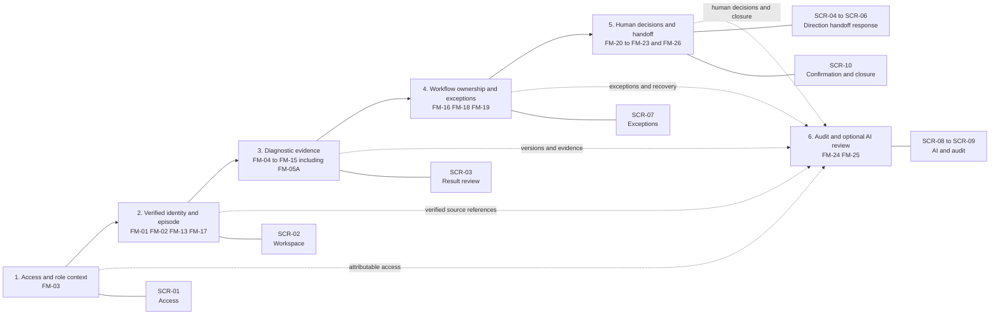

# Data Dictionary Visual Guide

## Purpose and status

This guide makes the relationships in `data_dictionary_and_screen_field_mapping.csv` easier to review. The CSV remains the authoritative Sprint 5 data dictionary. This document is a derived reading aid only: it does not create requirements, fields, screens, workflow states, permissions or behaviour.

All terminology, field groups, source boundaries, states and screen identifiers are inherited from the approved Sprint 1--4 artifacts and the authoritative Sprint 5 Markdown screen specification and navigation map. The wireframe PDF and PNG archive are not a source for this guide.

## How to read the coverage matrix

| Code | Meaning |
|---|---|
| `V` | The field is shown or read-only on that screen. |
| `E` | An authorised role may record controlled internal evidence; it does not alter an authoritative source record. |
| `B` | The field is validated or can block an action until the required evidence is present and valid. |
| `A` | The field's attributable evidence is displayed in the audit and trace view. |
| `—` | The field is not needed on that screen. |

Combined values such as `V/B` mean the field is displayed and also controls whether an action can proceed.

## Cross-screen data flow

The flow shows control dependencies, not automatic workflow advancement. Human decision rights and authorised events remain the only route to a canonical state transition.

## Screen-to-data coverage matrix

| Data group | SCR-01 | SCR-02 | SCR-03 | SCR-04 | SCR-05 | SCR-06 | SCR-07 | SCR-08 | SCR-09 | SCR-10 |
|---|---|---|---|---|---|---|---|---|---|---|
| FM-01 — Synthetic patient linkage | — | V | V/B | V/B | V/B | V/B | E | V/B | A | V/B |
| FM-02 — Encounter verification | — | V | V/B | V/B | V/B | V/B | E | V/B | A | V/B |
| FM-03 — Clinician and reporting-professional context | V/B | V | V/B | E/B | V/B | E/B | — | E/B | A | V/B |
| FM-04 — Diagnostic order identity | — | V | V | V | V/B | — | — | — | A | — |
| FM-05 — Diagnostic order clinical status | — | V | — | — | — | — | — | — | A | — |
| FM-05A — Diagnostic acceptance and scheduling evidence | — | V | — | — | — | — | E | — | A | — |
| FM-06 — Diagnostic code and reason | — | V | V | — | V/B | — | — | — | A | — |
| FM-07 — Requester and authored time | — | V | — | — | — | — | — | — | A | — |
| FM-08 — Diagnostic completion event | — | V | — | — | — | — | E | — | A | — |
| FM-09 — Observation identity and status | — | V | V/B | — | — | — | E | V/B | A | — |
| FM-10 — Observation value and timing | — | — | V/B | — | V/B | — | — | V/B | A | — |
| FM-11 — Report identity and version | — | V | V/B/E | V/B | V/B | — | E | V/B | A | V/B |
| FM-12 — Report status code and source completion condition | — | V/B | V/B | — | — | — | E | — | A | — |
| FM-13 — Report subject encounter and linkage evidence | — | V/B | V/B | — | — | — | E | V/B | A | — |
| FM-14 — Report and configured fixture result references | — | V/B | V/B | — | V/B | — | E | V/B | A | — |
| FM-15 — Report performer context | — | — | V | — | — | — | — | — | A | — |
| FM-16 — Workflow state | — | V | V | V/E | V | V/E | V/E | — | A | V/E |
| FM-17 — Episode linkage | — | V | V/B | — | — | — | E | — | A | — |
| FM-18 — Owner and SLA context | — | V | V/B | — | — | — | E | — | A | — |
| FM-19 — Exception evidence | — | V | B | B | B | B | V/E | B | A | B |
| FM-20 — Human decision evidence | — | — | E/B | E/B | — | E/B | V/E | — | A | E/B |
| FM-21 — Handoff readiness | — | — | — | — | V/E/B | V | E | V/E/B | A | V/B |
| FM-22 — Next-step evidence | — | — | — | E/B | — | V | V/E | — | A | V/E/B |
| FM-23 — Scoped closure evidence | — | — | — | V | — | — | V/E | — | A | V/E/B |
| FM-24 — Audit correction and correlation | — | V | V | V | V | V | V | V | V | V |
| FM-25 — AI draft and review workflow evidence | — | V | V/E | — | V/E | — | V | V/E/B | A | — |
| FM-26 — Communication and confirmation evidence | — | — | — | E/B | V/B | — | V/E | — | A | V/E/B |

## Review use

Use the CSV to answer what a field means, who owns it, and what happens if it is missing. Use this guide to check whether every screen has the data it needs and whether a field is being made editable or decision-making where the approved boundary permits only viewing, validation or audit.
