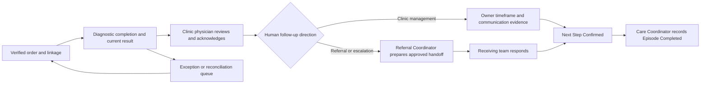
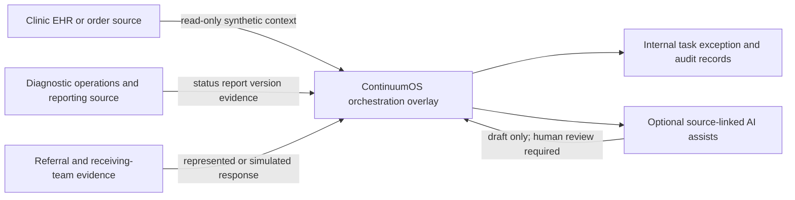
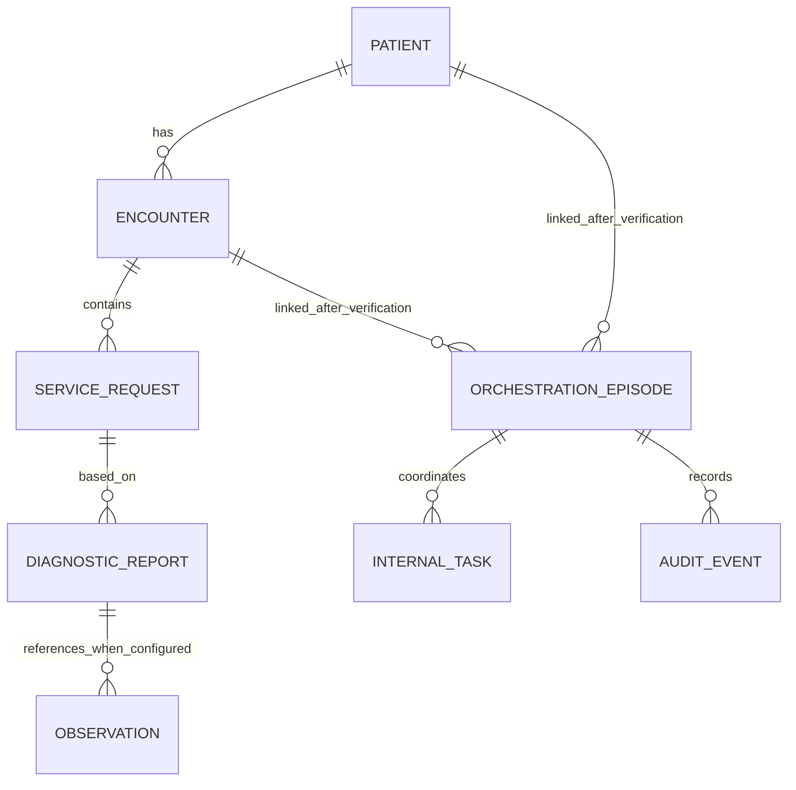
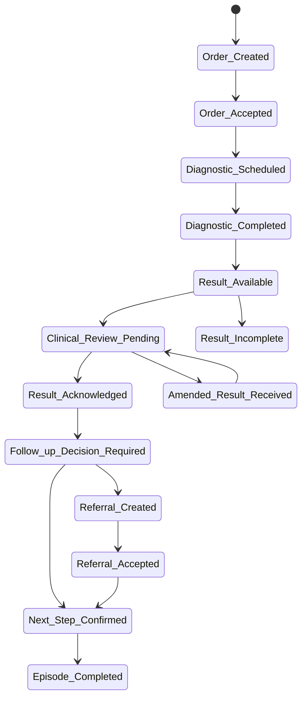

# Four-Diagram Traceability Pack

## Purpose and boundary

This pack gives one interview-friendly view of the four diagram types used in the case: business process, system context, logical data relationships and state lifecycle. It is derived from the approved canonical artifacts below. It introduces no new state, integration, data authority or implementation claim.

| Diagram type | Governing source | Use in the case |
|---|---|---|
| Business process | `mvp_diagnostic_workflow.md`; `future_state_workflow.md` | Shows people, decisions and handoffs. |
| System context | `simplified_architecture.md`; `system_of_record_table.csv` | Shows source authority and ContinuumOS boundaries. |
| Logical data relationship | `fhir_resource_map.md`; `field_mapping.csv`; `synthetic_fhir_resource_definitions.md` | Shows workflow-relevant information relationships, not a physical database ERD. |
| State lifecycle | `care_episode_state_model.md`; `state_transition_table.csv` | Shows permitted workflow progression and exception return. |

## 1. Business process diagram

## 2. System context diagram

## 3. Logical data relationship diagram

`INTERNAL_TASK`, `ORCHESTRATION_EPISODE` and `AUDIT_EVENT` are logical internal records, not asserted FHIR resources or a physical production schema.

## 4. State lifecycle diagram

The complete exception and safe-return semantics remain governed by the canonical state-transition table.
