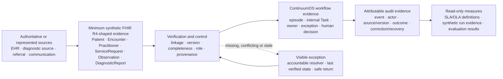

# Data-Governance Overview

## Purpose and boundary

This is a visual index of the ContinuumOS data-governance chain. It links the authoritative detailed artifacts rather than creating another data dictionary. All demonstrated data is synthetic. No live source-to-target pipeline, production refresh schedule, FHIR conformance, source write-back or operational KPI feed is claimed.

## Governance chain

| Information area | Authoritative source or owner | ContinuumOS use | Validation and exception rule | Downstream evidence |
|---|---|---|---|---|
| Patient identity | Registration/identity source; Identity reconciliation reviewer resolves uncertainty | Display minimum verified context and retain an internal linkage reference | Uncertain identity routes to `Patient Match Failed`; no silent attachment | Linkage decision, reviewer, source refs and `EVT-04` |
| Encounter | Encounter/clinic source | Confirm the episode context | Missing or conflicting encounter routes to `Encounter Missing` | Encounter reference, reconciliation and safe-return evidence |
| Diagnostic order | Clinic/order source | Link and display order context | `ServiceRequest` supports `Order Created` only; it cannot prove acceptance or scheduling | Source ID/version, requester/time and workflow event |
| Diagnostic operation | Diagnostic operations/source | Represent acceptance, scheduling and completion separately | Operational evidence is required; completion is not inferred from report status | `EVT-06` subtype, actor and time |
| Observation | Diagnostic source | Display source-linked supporting evidence where required | Observation presence alone does not establish `Result Available` | Observation ID/status/version and report linkage |
| Diagnostic report | Reporting source/professional | Display current report/version and create review work | Current accepted fixture status, version, configured refs and completion evidence are required; amendments reopen review | Report ID/version, prior/current refs, acknowledgement and correction history |
| Workflow state and internal Task | ContinuumOS orchestration layer | Track state, owner, due context, blocker, exception and human-decision request | State changes require approved deterministic and human evidence; duplicates cannot advance twice | State before/after, actor, event and task evidence |
| Referral and receiving response | Referral/receiving source and authorised human roles | Track approved package, route and represented response | Sending is not acceptance; coordinator recording is not receiving-team authority | Package/version, `EVT-12`–`EVT-14`, destination and response |
| Communication and confirmation | Approved communication record/authorised sender; Care Coordinator verifies closure evidence | Track preparation, approval, send, delivery and explicit confirmation separately | Sent/delivered does not prove understanding or satisfy closure by itself | Content/version, approver, sender, channel and confirmation refs |
| AI draft and disposition | ContinuumOS assistive fixture; authorised reviewer | Retain source links, version, uncertainty, draft status and human disposition | Wrong patient/version, stale or unavailable output cannot be accepted; manual workflow remains | `EVT-20`, reviewer, disposition, correction rationale and fallback |
| Audit history | ContinuumOS workflow history plus source references | Present append-oriented attributable evidence and linked corrections | Corrections append or supersede; users cannot destructively edit history | Event ID, time, actor/role, source/version, outcome and recovery |
| KPI/SLA evidence | Derived from governed workflow events | Calculate approved read-only measures | Definitions require numerator, denominator, window and data-quality qualification; metrics cannot change state | Synthetic run results and readiness hypotheses only |

## Minimum-data and access principles

- Retrieve and display only the fields needed for the approved workflow job.
- Preserve source IDs, versions and timestamps.
- Reference complete source records rather than copying a longitudinal clinical record.
- Keep the signed-in reviewing clinician distinct from the reporting professional.
- Treat role access as permission to perform an assigned job, not as transfer of decision authority.
- Do not allow AI to resolve identity, source conflicts or clinical meaning.
- Keep corrections attributable and linked to earlier evidence.
- Route missing, conflicting, duplicate, amended or unavailable evidence to a visible owner and recovery path.

## Evidence maturity

| Layer | Current evidence status |
|---|---|
| Source authority and field mapping | Designed and reviewed for the synthetic case |
| Synthetic FHIR-shaped fixtures | Implemented locally for one tracer |
| Linkage/version/business-rule validation | Implemented and tested locally |
| Workflow/audit presentation | Implemented as local and representative prototype evidence |
| Source integration and persistence | Simulated or excluded |
| KPI values | Controlled synthetic observations only |
| Production data governance | Not assessed; requires participant, privacy, security and interoperability approval |

## Detailed evidence

- [System-of-record table](../Sprint_2_Care_Journey_and_Operating_Model/system_of_record_table.csv)
- [Minimum FHIR resource map](../Sprint_3_Users_Decisions_and_MVP/fhir_resource_map.md)
- [Source/field mapping](../Sprint_3_Users_Decisions_and_MVP/field_mapping.csv)
- [Synthetic FHIR resource definitions](../Sprint_4_Architecture_and_AI_Operating_Model/synthetic_fhir_resource_definitions.md)
- [Audit and analytics data contract](../Sprint_4_Architecture_and_AI_Operating_Model/audit_and_analytics_data_contract.md)
- [Data dictionary and screen mapping](../Sprint_5_Clickable_Prototype/data_dictionary_and_screen_field_mapping.csv)
- [Data dictionary visual guide](../Sprint_5_Clickable_Prototype/data_dictionary_visual_guide.md)
- [SLA, OLA and KPI operating model](../Sprint_5_Clickable_Prototype/sla_ola_and_kpi_operating_model.md)
- [Synthetic reconciliation tracker](../Sprint_6_Prototype_Build_Testing_and_Controlled_Release/synthetic_data_validation_and_reconciliation_tracker.csv)
