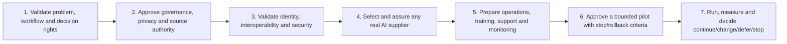

# Future Pilot Readiness

## Status

This is a future-readiness view, not a deployment plan or claim that a pilot, training programme, production integration, security assessment or change-management programme has occurred.

The current release decision permits structured synthetic review and synthetic workflow evaluation only.

## Readiness overview

| Readiness area | What exists now | Required before a real pilot | Accountable decision owner | Current status |
|---|---|---|---|---|
| Problem and workflow validation | Proposed workflow, synthetic tracer, internal Product Owner refinements | External clinical and operational review; participant-specific workflow and terminology validation | Participating clinical/operations sponsor and Product Owner | External review not completed |
| Governance and participation | Proposed RACI, decision rights and escalation boundaries | Named participating organisations, governance terms, escalation and decision forum | Participant governance lead | Not assessed |
| Clinical and operational policy | Human authority and evidence gates defined for the case | Approved local policy for review, acknowledgement, referral, communication, exceptions and closure | Clinical operations lead | Designed, not approved for real use |
| Privacy, legal basis and consent | Synthetic minimum-data principles | Jurisdiction-specific privacy/legal review, purpose limitation, consent/notice and data-use record | Privacy/legal lead | Not assessed |
| Identity and access | Simulated clinician launch and role-visible prototype | Production identity provider, authentication, session controls, role/access model and security tests | Security and application-access lead | Simulated only |
| Patient and encounter linkage | Linkage contract, synthetic exception and human reconciliation path | Production identifier/MPI policy, thresholds, reconciliation evidence and accountable operations | Identity governance lead | Synthetic control tested; production not assessed |
| Interoperability | FHIR R4-shaped fixtures, conceptual SMART sequence and field map | Interface specification, capability discovery, profiles, terminology, error semantics and conformance tests | Interoperability lead | No live connection or conformance claim |
| Source authority and data quality | System-of-record matrix, minimum fields, version rules and synthetic reconciliation | Participant data ownership, stewardship, correction, amendment, retention and live data-quality controls | Clinical/data governance lead | Designed for synthetic case |
| Security and resilience | Future control requirements recorded | Threat/risk assessment, encryption, logging, incident response, availability, backup and recovery tests | Security/platform lead | Not assessed |
| AI governance and supplier assurance | Two bounded use cases, control matrix, rubric, stale/fallback tests | Real supplier/model selection, rights, retention/training terms, subprocessors, threat testing, representative-data evaluation, monitoring and rollback | AI governance, procurement, legal and security leads | No model/API selected or called |
| Accessibility and communication | Accessible prototype controls and synthetic communication evidence model | Independent accessibility review, language/channel policy, authorised sender and confirmation rules | Accessibility and patient-communication leads | Prototype evidence only |
| Training and adoption | Roles and workflow responsibilities documented | Role-based training, operating procedures, change impacts, readiness assessment and adoption measures | Service operations/change lead | Not created or delivered |
| Support and incident management | Exception/recovery and fallback requirements | Support/on-call model, incident runbook, ownership, service levels and manual downgrade procedure | Service operations lead | Not assessed |
| Monitoring and KPI operations | KPI definitions and controlled synthetic observations | Approved baselines, targets, event quality, refresh timing, monitoring ownership and review cadence | Product/operations/data governance leads | No operational KPI feed |
| Pilot design and measurement | Synthetic run method and conditional review decision | Named participant, sample, duration, success/stop criteria, ethics/governance approvals and evidence plan | Pilot sponsor and Product Owner | Real pilot not approved |
| Rollout and hypercare | Go/No-Go and rollback principles | Controlled release plan, communications, support capacity, rollback rehearsal, hypercare ownership and exit criteria | Release/service owner | Outside current portfolio evidence |

## Proposed gate sequence

No gate is satisfied by this document alone.

## Entry conditions for a future pilot

- named participating organisation and sponsor;
- approved workflow, roles, decision rights and exception ownership;
- legal basis, privacy, consent/notice and minimum-data approval;
- tested identity, access, interoperability, terminology and reconciliation;
- security, resilience, audit and incident evidence;
- approved AI supplier/use case where AI is included;
- manual fallback and safe-downgrade procedure;
- training, support and communication readiness;
- explicit success, stop, rollback and data-quality criteria;
- external reviewer and participant evidence recorded without sensitive information.

## Stop or defer conditions

A pilot should not proceed when any of the following remains possible:

- uncertain patient or encounter attachment;
- authority bypass or autonomous consequential decision;
- stale or unsupported evidence remaining actionable;
- false referral, communication, confirmation or closure success;
- unrecoverable integration or workflow failure;
- AI failure blocking the core human workflow;
- material privacy, security or consent gap;
- no accountable owner for operations, incidents or rollback.

## Detailed sources

- [Illustrative deployment-readiness checklist](../Sprint_4_Architecture_and_AI_Operating_Model/illustrative_hie_deployment_readiness_checklist.md)
- [RAID register](../Sprint_5_Clickable_Prototype/raid_register.csv)
- [Go/No-Go, rollback and pilot-entry criteria](../Sprint_6_Prototype_Build_Testing_and_Controlled_Release/go_no_go_rollback_and_pilot_entry_criteria.md)
- [Product safety hazard and control register](../Sprint_6_Prototype_Build_Testing_and_Controlled_Release/product_safety_hazard_and_control_register.csv)
- [Release 0.2 notes](../Sprint_6_Prototype_Build_Testing_and_Controlled_Release/release_0_2_notes.md)
- [Reviewer plan](reviewer_plan_and_discussion_guide.md)
- [Final portfolio evidence pack](final_portfolio_evidence_pack.md)
